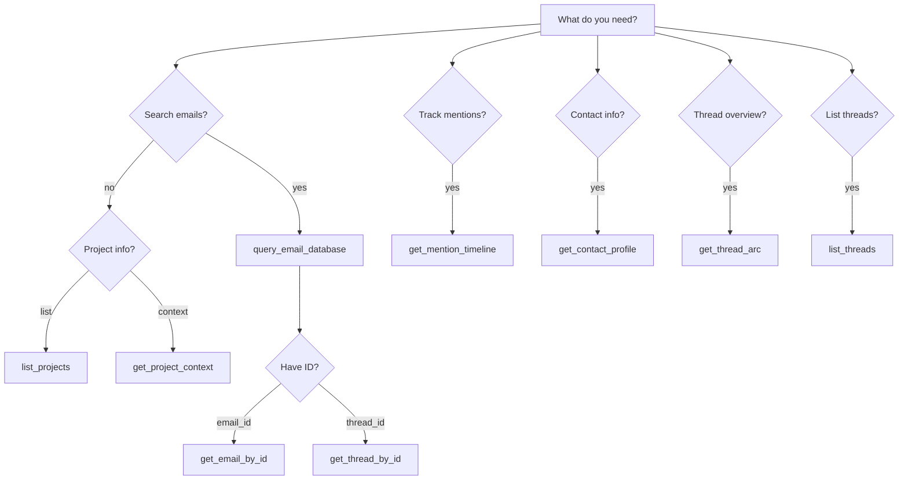

# AGENTS.md - Email Intelligence System

**Project:** Email Intelligence System  
**Location:** `emailindex/` directory in the workspace  
**Last Updated:** 2026-04-04

---

## Table of Contents

1. [Project Overview](#1-project-overview)
2. [Directory Structure](#2-directory-structure)
3. [MCP Tools Reference](#3-mcp-tools-reference)
4. [Tool Selection Rules](#4-tool-selection-rules)
5. [Thread Reconstruction](#5-thread-reconstruction)
6. [Attachment Handling](#6-attachment-handling)
7. [Context Guidelines](#7-context-guidelines)
8. [Query Examples](#8-query-examples)
9. [Data Model Reference](#9-data-model-reference)
10. [Testing & Validation](#10-testing--validation)

---

## 1. Project Overview

The Email Intelligence System parses personal email archives into a queryable SQLite database, exposing data via Model Context Protocol (MCP) for AI assistants. The system supports:

- **Full-text search** across email subjects and bodies
- **Semantic vector search** using embeddings (BAAI/bge-small-en-v1.5, 384 dimensions)
- **Conversation threading** based on RFC 822 headers
- **Attachment management** with SHA-256 deduplication
- **Parallel resumable ingestion** for large archives (12+ years of email) using ThreadPoolExecutor with configurable concurrency

## Configuration

| Variable | Default | Description |
|----------|---------|-------------|
| `HF_HUB_OFFLINE` | `1` | Set to `1` (default) to use cached model only and avoid HuggingFace Hub network checks. Set to `0` to allow model update checks (requires internet + optional `HF_TOKEN`). When `HF_HUB_OFFLINE=0`, unauthenticated Hub checks can hit rate limits and may cause first-query hangs/timeouts. |
| `HF_TOKEN` | — | Optional HuggingFace token for authenticated Hub access when `HF_HUB_OFFLINE=0`. Set this for online mode to avoid unauthenticated rate-limit stalls. |

---

## 2. Directory Structure

```
emailindex/
├── attachments/{YYYY}/{MM_Mon}/{thread_id}/{filename}  # Deduplicated attachments
├── db/emails.db                                        # Main SQLite database
├── ingestion/resume.json                               # Checkpoint for resumable ingestion
├── ingestion/resume_classify.json                      # Classification checkpoint
├── ingestion/logs/                                     # Ingestion + validation logs
├── mcp_server/                                         # MCP server package
│   ├── __init__.py
│   ├── config.py                                       # Configuration constants
│   ├── models.py                                       # Pydantic data models
│   ├── database.py                                     # SQLite queries, vector search
│   └── server.py                                       # MCP tool routing, JSON-RPC handler
├── run-mcp-server.py                                   # MCP entry point (JSON-RPC 2.0)
├── run-mcp-server.sh                                   # Shell wrapper script
├── ingest.py                                           # Main ingestion script (parallel, --concurrent-limit)
├── classify_emails.py                                  # Gemini batch classification
├── salvage_quotes.py                                   # Standalone quote re-salvage tool
├── requirements.txt
└── tests/
    ├── run_all_validations.py                          # Unified test runner
    ├── validate_extraction_pipeline.py
    ├── validate_attachments.py
    ├── validate_issue2.py
    ├── validate_issue4.py
    ├── validate_body_text.py
    ├── test_quote_salvage.py
    ├── test_mcp_tools.py
    ├── test_thread_arc.py
    ├── test_contact_profile.py
    ├── test_cursor_pagination.py
    ├── test_field_projection.py
    ├── test_mention_timeline.py
    ├── test_query_extensions.py
    ├── test_blob_exclusion.py
    ├── test_classify_pagination.py
    ├── cleanup.py
    └── stress_test_runner.py
```

### Key Paths

| Purpose | Path |
|---------|------|
| Database | `emailindex/db/emails.db` |
| Attachments | `emailindex/attachments/` (relative) |
| MCP Server | `emailindex/run-mcp-server.py` |
| Checkpoint | `emailindex/ingestion/resume.json` |

---

## 3. MCP Tools Reference

The MCP server exposes **9 tools**. Always use the correct tool for the task.

### 3.1 query_email_database

Unified email search with FTS5, vector similarity, and metadata filters.

| Parameter | Type | Description |
|-----------|------|-------------|
| `semantic_query` | string | Vector similarity search |
| `exact_keywords` | string | FTS5 exact match |
| `category_filter` | string | Comma-separated categories |
| `project_filter` | string | Comma-separated projects |
| `date_from` / `date_to` | string | ISO 8601 date range |
| `from_address` / `to_address` | string | Filter by sender/recipient |
| `from_name` | string | Filter by sender display name (LIKE match) |
| `is_outbound` | boolean | Filter by direction |
| `has_attachments` | boolean | Filter by attachments |
| `limit` | integer | Max results (default: 10, max: 50) |
| `include_full_thread` | boolean | Return full thread grouped by thread_id |
| `sort_by` | string | `timestamp` or `relevance` (auto-defaults) |
| `sort_order` | string | `asc` or `desc` (default: `desc`) |
| `count_only` | boolean | Return only count, no results |
| `fields` | array | Specific fields to return (field projection) |
| `snippet_only` | boolean | Return FTS5 snippet instead of full body |
| `snippet_length` | integer | FTS5 snippet token window size (default: 32) |
| `cursor` | string | Opaque pagination cursor from previous response |

**Returns:** `{ results: [...], threads?: { [thread_id]: [...] }, count?: number, next_cursor?: string }`

### 3.2 get_project_context

Get project metadata and relevant emails from project registry. **Only approved method for project-scoped thread reconstruction.**

| Parameter | Type | Required | Description |
|-----------|------|----------|-------------|
| `project_name` | string | Yes | Project name or alias |
| `limit` | integer | No | Max emails (default: 10, max: 50) |

**Returns:** `{ project: { name, aliases, summary, created_at }, emails: [...] }` or `null`

### 3.3 get_email_by_id

Fetch a specific email by UUID.

| Parameter | Type | Required | Description |
|-----------|------|----------|-------------|
| `email_id` | string | Yes | UUIDv4 of the email |

**Returns:** Full `EmailRecord` (see [Data Model](#9-data-model-reference)) or `null`

### 3.4 get_thread_by_id

Fetch all emails in a conversation thread.

| Parameter | Type | Required | Description |
|-----------|------|----------|-------------|
| `thread_id` | string | Yes | Thread ID (format: `thread-*`) |

**Returns:** `ConversationThread` with `emails[]` sorted oldest-first, or `null`

### 3.5 list_projects

List all projects in the registry.

| Parameter | Type | Required | Description |
|-----------|------|----------|-------------|
| `limit` | integer | No | Max projects (default: 20, max: 50) |

**Returns:** `{ projects: [{ name, aliases, summary, created_at }], count }`

### 3.6 get_mention_timeline

Get a timeline of keyword mentions grouped by year, month, or quarter.

| Parameter | Type | Required | Description |
|-----------|------|----------|-------------|
| `keyword` | string | Yes | Exact keyword or name |
| `granularity` | string | No | `year`, `month`, or `quarter` (default: `year`) |
| `date_from` / `date_to` | string | No | ISO 8601 date range |
| `from_address` | string | No | Filter by sender |
| `is_outbound` | boolean | No | Filter by direction |

**Returns:** `{ timeline: [{ period, count }], total_mentions }`

### 3.7 get_contact_profile

Get a contact profile with interaction history and sample emails.

| Parameter | Type | Required | Description |
|-----------|------|----------|-------------|
| `name` | string | No | Fuzzy match on from_name |
| `email_address` | string | No | Exact or partial match on from_address |
| `limit` | integer | No | Representative emails (default: 10, max: 50) |
| `include_timeline` | boolean | No | Include mention timeline (default: `true`) |

**Returns:** `{ contact: { name, email, total_emails, first_seen, last_seen, ... }, emails: [...], timeline?: [...] }` or `null`

### 3.8 get_thread_arc

Get a thread arc showing messages in a conversation with participant info.

| Parameter | Type | Required | Description |
|-----------|------|----------|-------------|
| `thread_id` | string | Yes | Thread ID from query result |
| `mode` | string | No | `summary` or `full` (default: `summary`) |
| `max_messages` | integer | No | Max messages (default: 20, max: 50) |

**Returns:** `{ thread_id, subject, participants: [...], message_count, date_range, overview?: string, messages?: [...] }` or `null`

### 3.9 list_threads

List all conversation threads sorted by various metrics.

| Parameter | Type | Required | Description |
|-----------|------|----------|-------------|
| `sort_by` | string | No | `message_count`, `participant_count`, `last_activity`, `first_activity` (default: `message_count`) |
| `sort_order` | string | No | `asc` or `desc` (default: `desc`) |
| `limit` | integer | No | Max threads (default: 10, max: 50) |

**Returns:** `{ threads: [{ thread_id, subject, message_count, participant_count, ... }], count }`

---

## 4. Tool Selection Rules

### Decision Matrix

| If you want to... | Use |
|-------------------|-----|
| Find emails by keyword | `query_email_database(exact_keywords=...)` |
| Find semantically similar emails | `query_email_database(semantic_query=...)` |
| Filter by category/project tags | `query_email_database(category_filter=...)` / `project_filter` |
| Get project context | `get_project_context(project_name=...)` |
| Filter by date range | `query_email_database(date_from=..., date_to=...)` |
| Filter by sender/recipient | `query_email_database(from_address=..., to_address=...)` |
| Filter by sender name | `query_email_database(from_name=...)` |
| Get full thread in results | `query_email_database(include_full_thread=true)` |
| Fetch specific email by ID | `get_email_by_id(email_id=...)` |
| Fetch full thread by ID | `get_thread_by_id(thread_id=...)` |
| Discover available projects | `list_projects()` |
| Track keyword mentions over time | `get_mention_timeline(keyword=...)` |
| Get contact profile and history | `get_contact_profile(email_address=...)` |
| Get thread arc with participants | `get_thread_arc(thread_id=...)` |
| List threads by activity | `list_threads(sort_by=...)` |
| Paginate large result sets | `query_email_database(..., cursor=...)` |
| Get only result count | `query_email_database(..., count_only=true)` |
| Reduce response size | `query_email_database(..., fields=[...])` or `snippet_only=true` |

### Decision Tree



### NEVER Do These

| Forbidden | Why | Correct |
|-----------|-----|---------|
| Group emails by subject | Unreliable, ignores headers | Use `thread_id` or `include_full_thread=true` |
| Load `raw_eml` into context | Too large (10-100KB) | Use `body_markdown` |
| Use `message_id` as key | Has angle brackets, not UUID | Use `id` (UUIDv4) |
| Use absolute attachment paths | Breaks across systems | Paths in JSON are relative to `emailindex/` |

---

## 5. Thread Reconstruction

Threads are built from RFC 822 headers in priority order:

1. **Primary:** `References` header (ordered Message-ID chain)
2. **Secondary:** `In-Reply-To` header (parent Message-ID)
3. **Fallback:** `subject_thread_key` (normalized subject) — only when headers missing

```
Email A (root)     Message-ID: <msg-A>        → thread_id = hash(<msg-A>)
Email B (reply)    In-Reply-To: <msg-A>       → same thread_id
Email C (reply)    References: <msg-A> <msg-B> → same thread_id
```

**Rule:** `thread_id` is authoritative (explicitly linked via headers). `subject_thread_key` is fallback only (false positives possible).

**Correct pattern:**
```python
email = get_email_by_id(email_id="550e8400-e29b-41d4-a716-446655440000")
thread = get_thread_by_id(thread_id=email.thread_id)
```

---

## 6. Attachment Handling

### Structure

```json
{
  "filename": "invoice.pdf",
  "path": "attachments/2024/01_Jan/thread-abc123/invoice.pdf",
  "mime_type": "application/pdf",
  "size_bytes": 45000,
  "sha256": "e3b0c44..."
}
```

**Path resolution:** Paths in the `attachments` JSON are relative to `emailindex/`. Construct full path as `{emailindex_root}/{attachment.path}`.

### Key behaviors

- **Deduplication:** Same SHA-256 = same file on disk. Multiple emails reference the same path.
- **Inline images (CID):** Converted to Markdown in `body_markdown`: ``
- **Attachment section:** `body_markdown` ends with a `### Attachments` list when files are present

---

## 7. Context Guidelines

### What to include vs exclude

| Field | Size | Include? |
|-------|------|----------|
| `body_markdown` | 2-50 KB | **Yes** — primary content (truncate if needed) |
| `body_plain` | varies | Fallback when `body_markdown` empty |
| `subject`, `from_*`, `to_*`, `timestamp` | small | **Yes** — identification |
| `attachments` array | <1 KB | **Yes** — list only, don't load files |
| `thread_id` | small | **Yes** — navigation |
| `raw_eml` | 10-100 KB | **Never** — compressed original |
| `embedding` | 1.5 KB | **Never** — binary vector data |

### Building context

```python
context = f"""
Subject: {email.subject}
From: {email.from_name or email.from_address} <{email.from_address}>
To: {', '.join(email.to_addresses)}
Date: {email.timestamp}

{email.body_markdown}

Attachments: {', '.join(a['filename'] for a in email.attachments)}
"""
```

---

## 8. Query Examples

### Keyword + date filter
```python
query_email_database(
    exact_keywords="invoice",
    date_from="2024-01-01", date_to="2024-12-31",
    limit=20
)
```

### Semantic search
```python
query_email_database(semantic_query="quarterly planning meeting", limit=10)
```

### Full thread retrieval
```python
results = query_email_database(exact_keywords="project update", include_full_thread=True, limit=5)
if "threads" in results:
    for tid, emails in results["threads"].items():
        print(f"Thread {tid}: {len(emails)} emails")
```

### Filter by tags
```python
query_email_database(category_filter="work,financial", limit=20)
query_email_database(project_filter="ProjectAlpha", limit=20)
```

### Project context
```python
ctx = get_project_context(project_name="ProjectAlpha", limit=10)
if ctx:
    print(f"Project: {ctx['project']['name']}, Summary: {ctx['project']['summary']}")
```

### Complex search
```python
query_email_database(
    exact_keywords="report",
    from_address="boss@company.com",
    category_filter="work",
    has_attachments=True,
    date_from="2024-01-01",
    limit=50
)
```

### Cursor pagination
```python
results = query_email_database(exact_keywords="budget", limit=20)
while results.get("next_cursor"):
    results = query_email_database(exact_keywords="budget", limit=20, cursor=results["next_cursor"])
```

### Field projection
```python
query_email_database(exact_keywords="invoice", fields=["id", "subject", "timestamp", "from_address"])
```

### Mention timeline
```python
timeline = get_mention_timeline(keyword="budget", granularity="month", date_from="2024-01-01", date_to="2024-12-31")
for entry in timeline["timeline"]:
    print(f"{entry['period']}: {entry['count']} mentions")
```

### Contact profile
```python
profile = get_contact_profile(email_address="alice@company.com", limit=5, include_timeline=True)
print(f"Total emails from {profile['contact']['name']}: {profile['contact']['total_emails']}")
```

### Thread arc
```python
arc = get_thread_arc(thread_id="thread-abc123", mode="summary")
print(f"Thread: {arc['subject']}, {arc['message_count']} messages, {arc['participant_count']} participants")
```

### List threads
```python
threads = list_threads(sort_by="message_count", sort_order="desc", limit=10)
for t in threads["threads"]:
    print(f"{t['subject']}: {t['message_count']} messages")
```

---

## 9. Data Model Reference

### EmailRecord (full)
```typescript
interface EmailRecord {
  id: string;                      // UUIDv4 primary key
  message_id: string;             // RFC 822 Message-ID (UNIQUE)
  thread_id: string | null;       // From References chain
  subject_thread_key: string;     // Normalized subject
  timestamp: string;              // ISO 8601
  from_address: string;
  from_name: string | null;
  to_addresses: string[];
  cc_addresses: string[] | null;
  subject: string;
  body_markdown: string;          // HTML→Markdown (prefer this)
  body_plain: string | null;      // Plain text fallback
  body_text: string;              // Cleaned content
  x_mailer: string | null;
  has_attachments: boolean;
  attachments: AttachmentRecord[];
  folder: string;                 // Maildir folder
  raw_eml: Buffer | null;         // Zstd-compressed (never load)
  embedding: Buffer | null;       // sqlite-vec (384-dim)
  sender: string;                 // Canonical sender address
  recipients: string[];           // All recipients
  category_tags: string[];        // AI + rule-based categories
  project_tags: string[];         // AI-discovered project tags
  is_outbound: boolean;           // True if sender is user
  parent_id: string | null;       // Parent for salvaged replies
  source: string;                 // "original" or "quoted_reply"
  content_hash: string | null;    // SHA-256 of normalized body
}
```

### EmailSearchResult (limited, from search)
```typescript
interface EmailSearchResult {
  id: string;
  thread_id: string | null;
  subject: string;
  timestamp: string;
  from_address: string;
  from_name: string | null;
  snippet: string;               // Relevant excerpt
  score: number | null;          // Vector relevance score
  has_attachments: boolean;
  folder: string;
}
```

### ConversationThread
```typescript
interface ConversationThread {
  thread_id: string;
  subject: string;
  emails: EmailRecord[];         // Sorted oldest-first
  participant_count: number;
  date_range: [string, string];  // [earliest, latest]
  attachment_count: number;
}
```

### AttachmentRecord
```typescript
interface AttachmentRecord {
  filename: string;
  path: string;                  // Relative to emailindex/
  mime_type: string;
  size_bytes: number;
  sha256: string;
  is_visual: boolean;            // True for images (png, jpg, gif, svg)
}
```

---

## 10. Testing & Validation

All tests must clean up temp files in `finally` blocks. No artifacts may persist.

### Test Scripts

| Script | Validates |
|--------|-----------|
| `tests/run_all_validations.py` | **Unified runner** — full pipeline coverage |
| `tests/validate_extraction_pipeline.py` | Maildir→DB field fidelity, body content, headers |
| `tests/validate_attachments.py` | Files on disk vs DB records, orphaned files |
| `tests/validate_issue4.py` | sqlite-vec, embedding dimensions, similarity search |
| `tests/validate_body_text.py` | Body text field validation |
| `tests/validate_issue2.py` | Issue-specific validation |
| `tests/test_quote_salvage.py` | pytest: quote salvage pipeline |
| `tests/test_mcp_tools.py` | pytest: MCP tool responses |
| `tests/test_thread_arc.py` | pytest: get_thread_arc tool |
| `tests/test_contact_profile.py` | pytest: get_contact_profile tool |
| `tests/test_cursor_pagination.py` | pytest: keyset pagination |
| `tests/test_field_projection.py` | pytest: field projection |
| `tests/test_mention_timeline.py` | pytest: get_mention_timeline tool |
| `tests/test_query_extensions.py` | pytest: query parameter extensions |
| `tests/test_blob_exclusion.py` | pytest: raw_eml/embedding not leaked |
| `tests/test_classify_pagination.py` | pytest: classification pagination |
| `tests/stress_test_runner.py` | Load/stress testing |

### Running Tests

```bash
# Summary
python tests/run_all_validations.py

# Verbose / JSON / specific pipeline
python tests/run_all_validations.py --verbose
python tests/run_all_validations.py --json
python tests/run_all_validations.py --filter extraction  # or: attachments, vector

# Individual scripts
python tests/validate_extraction_pipeline.py --verbose
python tests/validate_attachments.py --verbose --has-attachments-fix
python tests/validate_issue4.py --verbose
```

### Interpreting Results

| Indicator | Meaning |
|-----------|---------|
| `✅ PASS` | All checks passed |
| `❌ FAIL` | One or more checks failed (see output for specifics) |
| `⏭️ SKIP` | Missing data dependencies |
| `⚠️ ERROR` | Couldn't run (missing DB, maildir, etc.) |

### Investigating Failures

Validation logs are written to `ingestion/logs/validation_YYYYMMDD_HHMMSS.log` with per-check details and actual vs expected values.

```bash
grep -i "email-id-here" ingestion/logs/validation_*.log
grep -i "attachment-name" ingestion/logs/validation_*.log
```

### Prerequisites

Tests require: `db/emails.db`, `maildir/cur/` (original .eml files), and `attachments/` directory. Missing dependencies cause `ERROR` and skipped checks.

---

**End of AGENTS.md**
