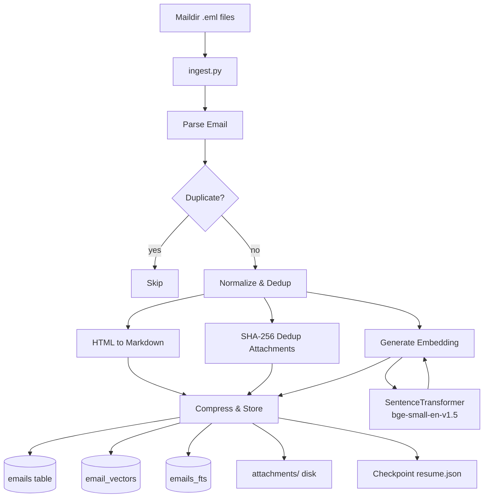
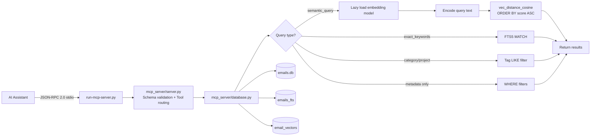

# Email Intelligence System - Project Scaffold

**Version:** 2.0.0  
**Last Updated:** 2026-04-02  
**Status:** Production - v2 schema with vector search

---

## 1. Directory Structure

```
emailindex/
├── attachments/                          # All email attachments stored on disk
│   └── {YYYY}/                          # Year folders (e.g., 2015, 2016, ...)
│       └── {MM_Mon}/                    # Month folders (e.g., 01_Jan, 02_Feb, ...)
│           └── {thread_id}/              # Thread-scoped subdirectory
│               └── {filename}            # Deduplicated by SHA-256 hash
│
├── db/                                  # Database directory
│   └── emails.db                        # Main SQLite database with sqlite-vec
│
├── ingestion/                           # Ingestion pipeline artifacts
│   ├── resume.json                      # Checkpoint file for resumable ingestion
│   └── logs/                            # Ingestion and validation logs
│       ├── ingestion_{YYYYMMDD}.log
│       └── validation_{YYYYMMDD_HHMMSS}.log
│
├── maildir/                             # SOURCE: User's Maildir archive (input only)
│
├── mcp_server/                          # MCP server package
│   ├── __init__.py                      # Package init (empty)
│   ├── server.py                        # Main MCP server entry point + schema validation
│   ├── database.py                      # SQLite queries, lazy embedding model, vector search
│   ├── models.py                        # Pydantic models (EmailRecord, AttachmentRecord, etc.)
│   └── config.py                        # Configuration constants
│
├── tests/                               # Test suite
│   ├── run_all_validations.py           # Unified test runner
│   ├── validate_extraction_pipeline.py  # Email extraction quality
│   ├── validate_attachments.py          # Attachment pipeline
│   └── validate_issue4.py               # Vector/embedding pipeline
│
├── classify_emails.py                   # Batch classification script with Gemini
├── migrate_v2.py                        # Schema migration for v2 columns
├── ingest.py                            # Main ingestion script
├── run-mcp-server.py                    # MCP entry point (JSON-RPC 2.0 wrapper)
├── run-mcp-server.sh                    # Shell script wrapper
├── requirements.txt                     # Python dependencies
├── AGENTS.md                            # AI assistant usage guide
└── README.md                            # Project overview and setup guide
```

---

## 2. SQLite Schema

### 2.1 Core Table (v2)

```sql
-- Main emails table (v2 schema)
CREATE TABLE IF NOT EXISTS emails (
    id TEXT PRIMARY KEY,                    -- UUIDv4, generated at ingest time
    message_id TEXT UNIQUE NOT NULL,        -- RFC 822 Message-ID, dedup key
    thread_id TEXT,                         -- From References/In-Reply-To chain
    subject_thread_key TEXT,                -- Normalized subject (Re:/Fwd: stripped)
    
    -- Timing and parties
    timestamp TEXT NOT NULL,                -- ISO 8601 (e.g., "2024-01-15T14:30:00Z")
    from_address TEXT NOT NULL,             -- Envelope sender email
    from_name TEXT,                         -- Display name (may be empty)
    to_addresses TEXT NOT NULL,             -- JSON array: ["a@b.com", "c@d.com"]
    cc_addresses TEXT,                      -- JSON array, nullable
    
    -- Content
    subject TEXT NOT NULL,                  -- Raw subject line
    body_markdown TEXT NOT NULL,            -- HTML->Markdown, main body text
    body_plain TEXT,                        -- Plain text fallback
    x_mailer TEXT,                          -- X-Mailer/User-Agent header
    
    -- Attachments
    has_attachments INTEGER NOT NULL DEFAULT 0,  -- 0 or 1, no booleans in SQLite
    attachments TEXT,                           -- JSON array: [{"filename": "...", "path": "...", "mime_type": "..."}]
    
    -- Storage
    folder TEXT NOT NULL,                   -- Maildir folder: "INBOX", "Sent", ".Drafts"
    raw_eml BLOB,                           -- Zstd-compressed original .eml bytes
    embedding BLOB,                         -- sqlite-vec float32[384] vector
    
    -- v2 columns (added by migrate_v2.py)
    sender TEXT,                            -- Canonical sender address
    recipients TEXT,                        -- All recipients as JSON array
    body_text TEXT,                         -- Cleaned content text
    category_tags TEXT,                     -- JSON array of category tags
    project_tags TEXT,                      -- JSON array of project tags
    is_outbound INTEGER,                    -- 1 if sender is user, 0 otherwise
    parent_id TEXT,                         -- UUID of parent for salvaged replies
    source TEXT DEFAULT 'original',         -- 'original' or 'quoted_reply'
    content_hash TEXT,                      -- SHA-256 of normalized body
    
    -- Constraints
    CONSTRAINT message_id_not_empty CHECK (message_id <> '')
);

-- Indexes for common query patterns
CREATE INDEX IF NOT EXISTS idx_emails_timestamp ON emails(timestamp);
CREATE INDEX IF NOT EXISTS idx_emails_thread_id ON emails(thread_id);
CREATE INDEX IF NOT EXISTS idx_emails_subject_thread_key ON emails(subject_thread_key);
CREATE INDEX IF NOT EXISTS idx_emails_from_address ON emails(from_address);
CREATE INDEX IF NOT EXISTS idx_emails_folder ON emails(folder);
CREATE INDEX IF NOT EXISTS idx_emails_content_hash ON emails(content_hash);
CREATE INDEX IF NOT EXISTS idx_emails_project_search ON emails(timestamp, sender, category_tags);

-- Full-text search on subject and body
CREATE VIRTUAL TABLE IF NOT EXISTS emails_fts USING fts5(
    subject,
    body_markdown,
    content='emails',
    content_rowid='rowid'
);

-- Triggers to keep FTS in sync
CREATE TRIGGER IF NOT EXISTS emails_fts_insert AFTER INSERT ON emails BEGIN
    INSERT INTO emails_fts(rowid, subject, body_markdown) VALUES (NEW.rowid, NEW.subject, NEW.body_markdown);
END;

CREATE TRIGGER IF NOT EXISTS emails_fts_delete AFTER DELETE ON emails BEGIN
    INSERT INTO emails_fts(emails_fts, rowid, subject, body_markdown) VALUES('delete', OLD.rowid, OLD.subject, OLD.body_markdown);
END;

CREATE TRIGGER IF NOT EXISTS emails_fts_update AFTER UPDATE ON emails BEGIN
    INSERT INTO emails_fts(emails_fts, rowid, subject, body_markdown) VALUES('delete', OLD.rowid, OLD.subject, OLD.body_markdown);
    INSERT INTO emails_fts(rowid, subject, body_markdown) VALUES (NEW.rowid, NEW.subject, NEW.body_markdown);
END;
```

### 2.2 Vector Search (sqlite-vec)

```sql
-- Vector search table for semantic similarity
-- bge-small-en-v1.5 produces 384-dimensional vectors
-- Note: ingest.py stores embeddings in both emails.embedding BLOB
-- and email_vectors for sqlite-vec operations

CREATE VIRTUAL TABLE IF NOT EXISTS email_vectors USING vec0(
    email_id TEXT,                          -- References emails.id
    embedding FLOAT[384]                    -- 384 dimensions for bge-small-en-v1.5
);
```

### 2.3 Full-Text Search (FTS5)

```sql
-- Full-text search on subject and body
CREATE VIRTUAL TABLE IF NOT EXISTS emails_fts USING fts5(
    subject,
    body_markdown,
    content='emails',
    content_rowid='rowid'
);

-- Triggers to keep FTS in sync
CREATE TRIGGER IF NOT EXISTS emails_fts_insert AFTER INSERT ON emails BEGIN
    INSERT INTO emails_fts(rowid, subject, body_markdown) VALUES (NEW.rowid, NEW.subject, NEW.body_markdown);
END;

CREATE TRIGGER IF NOT EXISTS emails_fts_delete AFTER DELETE ON emails BEGIN
    INSERT INTO emails_fts(emails_fts, rowid, subject, body_markdown) VALUES('delete', OLD.rowid, OLD.subject, OLD.body_markdown);
END;

CREATE TRIGGER IF NOT EXISTS emails_fts_update AFTER UPDATE ON emails BEGIN
    INSERT INTO emails_fts(emails_fts, rowid, subject, body_markdown) VALUES('delete', OLD.rowid, OLD.subject, OLD.body_markdown);
    INSERT INTO emails_fts(rowid, subject, body_markdown) VALUES (NEW.rowid, NEW.subject, NEW.body_markdown);
END;
```

### 2.4 Category & Project Tags FTS

```sql
-- FTS5 index for tag-based filtering
CREATE VIRTUAL TABLE IF NOT EXISTS email_category_fts USING fts5(
    category_tags,
    project_tags,
    content='emails'
);

-- Triggers to keep category FTS in sync
CREATE TRIGGER IF NOT EXISTS emails_ai AFTER INSERT ON emails BEGIN
    INSERT INTO email_category_fts(rowid, category_tags, project_tags) 
    VALUES (new.rowid, new.category_tags, new.project_tags);
END;

CREATE TRIGGER IF NOT EXISTS emails_ad AFTER DELETE ON emails BEGIN
    INSERT INTO email_category_fts(email_category_fts, rowid, category_tags, project_tags) 
    VALUES('delete', old.rowid, old.category_tags, old.project_tags);
END;

CREATE TRIGGER IF NOT EXISTS emails_au AFTER UPDATE ON emails BEGIN
    INSERT INTO email_category_fts(email_category_fts, rowid, category_tags, project_tags) 
    VALUES('delete', old.rowid, old.category_tags, old.project_tags);
    INSERT INTO email_category_fts(rowid, category_tags, project_tags) 
    VALUES (new.rowid, new.category_tags, new.project_tags);
END;
```

### 2.5 Attachment Tracking Table

```sql
-- Track SHA-256 hashes for deduplication
CREATE TABLE IF NOT EXISTS attachment_hashes (
    sha256 TEXT PRIMARY KEY,                -- SHA-256 hash of file content
    first_email_id TEXT,                    -- Email that first introduced this file
    path TEXT NOT NULL,                     -- Disk path to the stored file
    filename TEXT NOT NULL,                 -- Original filename
    mime_type TEXT,                         -- Detected MIME type
    size_bytes INTEGER NOT NULL,            -- File size
    created_at TEXT NOT NULL                -- ISO 8601 timestamp
);
```

### 2.6 Project Registry

```sql
-- Project metadata for contextual queries
CREATE TABLE IF NOT EXISTS project_registry (
    name TEXT PRIMARY KEY,                  -- Project name
    aliases TEXT,                           -- Alternative names (comma-separated)
    summary TEXT,                           -- Project description
    created_at TEXT                         -- ISO 8601 timestamp
);
```

### 2.3 Full-Text Search (FTS5)

```sql
-- Full-text search on subject and body
CREATE VIRTUAL TABLE IF NOT EXISTS emails_fts USING fts5(
    subject,
    body_markdown,
    content='emails',
    content_rowid='rowid'
);

-- Triggers to keep FTS in sync
CREATE TRIGGER IF NOT EXISTS emails_fts_insert AFTER INSERT ON emails BEGIN
    INSERT INTO emails_fts(rowid, subject, body_markdown) VALUES (NEW.rowid, NEW.subject, NEW.body_markdown);
END;

CREATE TRIGGER IF NOT EXISTS emails_fts_delete AFTER DELETE ON emails BEGIN
    INSERT INTO emails_fts(emails_fts, rowid, subject, body_markdown) VALUES('delete', OLD.rowid, OLD.subject, OLD.body_markdown);
END;

CREATE TRIGGER IF NOT EXISTS emails_fts_update AFTER UPDATE ON emails BEGIN
    INSERT INTO emails_fts(emails_fts, rowid, subject, body_markdown) VALUES('delete', OLD.rowid, OLD.subject, OLD.body_markdown);
    INSERT INTO emails_fts(rowid, subject, body_markdown) VALUES (NEW.rowid, NEW.subject, NEW.body_markdown);
END;
```

### 2.4 Category & Project Tags FTS

```sql
-- FTS5 index for tag-based filtering
CREATE VIRTUAL TABLE IF NOT EXISTS email_category_fts USING fts5(
    category_tags,
    project_tags,
    content='emails'
);

-- Triggers to keep category FTS in sync
CREATE TRIGGER IF NOT EXISTS emails_ai AFTER INSERT ON emails BEGIN
    INSERT INTO email_category_fts(rowid, category_tags, project_tags) 
    VALUES (new.rowid, new.category_tags, new.project_tags);
END;

CREATE TRIGGER IF NOT EXISTS emails_ad AFTER DELETE ON emails BEGIN
    INSERT INTO email_category_fts(email_category_fts, rowid, category_tags, project_tags) 
    VALUES('delete', old.rowid, old.category_tags, old.project_tags);
END;

CREATE TRIGGER IF NOT EXISTS emails_au AFTER UPDATE ON emails BEGIN
    INSERT INTO email_category_fts(email_category_fts, rowid, category_tags, project_tags) 
    VALUES('delete', old.rowid, old.category_tags, old.project_tags);
    INSERT INTO email_category_fts(rowid, category_tags, project_tags) 
    VALUES (new.rowid, new.category_tags, new.project_tags);
END;
```

### 2.5 Attachment Tracking Table

```sql
-- Track SHA-256 hashes for deduplication
CREATE TABLE IF NOT EXISTS attachment_hashes (
    sha256 TEXT PRIMARY KEY,                -- SHA-256 hash of file content
    first_email_id TEXT,                    -- Email that first introduced this file
    path TEXT NOT NULL,                     -- Disk path to the stored file
    filename TEXT NOT NULL,                 -- Original filename
    mime_type TEXT,                         -- Detected MIME type
    size_bytes INTEGER NOT NULL,            -- File size
    created_at TEXT NOT NULL                -- ISO 8601 timestamp
);
```

### 2.6 Project Registry

```sql
-- Project metadata for contextual queries
CREATE TABLE IF NOT EXISTS project_registry (
    name TEXT PRIMARY KEY,                  -- Project name
    aliases TEXT,                           -- Alternative names (comma-separated)
    summary TEXT,                           -- Project description
    created_at TEXT                         -- ISO 8601 timestamp
);
```

---

## 3. Data Flow Diagram

### Ingestion Pipeline



### MCP Query Path



---

## 4. Key Engineering Decisions

### 4.1 SQLite over PostgreSQL/MySQL
- **Reason:** Single-file database simplifies backup, portability, and deployment
- **Trade-off:** No concurrent write support (acceptable for read-heavy MCP use case)
- **Alternative considered:** DuckDB (no sqlite-vec support at time of design)

### 4.2 sqlite-vec for Vector Search
- **Reason:** Native SQLite extension, no separate vector DB needed
- **Trade-off:** Requires custom SQLite build with vec0 extension
- **Model choice (bge-small-en-v1.5):** 384 dims is manageable, local inference fast
- **Alternative considered:** pgvector (requires separate DB), OpenAI embeddings (API cost)

### 4.3 Attachments on Disk, Not BLOBs
- **Reason:** SQLite BLOBs > 1MB cause performance issues
- **Rationale:** Attachments can be large (images, PDFs), disk storage is more efficient
- **Deduplication:** SHA-256 ensures one copy per unique file across all emails

### 4.4 Zstd Compression for raw_eml
- **Reason:** Zstd offers best balance of compression ratio vs. speed
- **Typical ratio:** 3-5x for email content
- **Trade-off:** Slight CPU overhead on read (acceptable for occasional raw_eml access)

### 4.5 HTML→Markdown with Inline Image Replacement
- **Reason:** AI models understand Markdown better than HTML
- **Implementation:** beautifulsoup4 + markdownify chain
- **Inline images:** Convert to relative Markdown image refs for display

### 4.6 Thread ID Strategy
- **Primary:** References header chain (most accurate)
- **Fallback:** subject_thread_key (handles broken/missing headers)
- **Rationale:** Never merge into one field; different use cases need different granularity
- **Note:** Two emails with same thread_id ARE in same conversation; two emails with same subject_thread_key MIGHT be related

### 4.7 Batch Size of 500
- **Reason:** Balances checkpoint frequency vs. I/O overhead
- **Trade-off:** 500 emails ≈ 5-15 minutes depending on attachment sizes
- **Graceful shutdown:** resume.json enables exact pick-up point

### 4.8 stdio Transport for MCP
- **Reason:** Simplest integration for CLI tools and AI assistants
- **Alternative considered:** HTTP (more complex, less portable)
- **Trade-off:** No persistent connection (stateless requests)

---

## 5. Pydantic Models

### 5.1 EmailRecord

```python
# File: mcp_server/models.py

from __future__ import annotations
from datetime import datetime
from typing import Optional
from pydantic import BaseModel, Field, field_validator
import uuid


class AttachmentRecord(BaseModel):
    """Represents a single email attachment."""
    
    filename: str = Field(..., description="Original filename from email")
    path: str = Field(..., description="Relative path from emailindex/ directory")
    mime_type: str = Field(..., description="MIME type (e.g., 'image/png', 'application/pdf')")
    size_bytes: Optional[int] = Field(None, description="File size in bytes")
    sha256: Optional[str] = Field(None, description="SHA-256 hash for deduplication")
    
    @field_validator('path')
    @classmethod
    def path_must_be_relative(cls, v: str) -> str:
        if v.startswith('/'):
            raise ValueError("Attachment path must be relative to emailindex/")
        return v
    
    model_config = {
        "json_schema_extra": {
            "example": {
                "filename": "invoice.pdf",
                "path": "attachments/2024/01_Jan/abc123-thread/invoice.pdf",
                "mime_type": "application/pdf",
                "size_bytes": 45000,
                "sha256": "e3b0c44298fc1c149afbf4c8996fb92427ae41e4649b934ca495991b7852b855"
            }
        }
    }


class EmailRecord(BaseModel):
    """Complete email record as stored in SQLite."""
    
    id: str = Field(..., description="UUIDv4 primary key")
    message_id: str = Field(..., description="RFC 822 Message-ID header")
    thread_id: Optional[str] = Field(None, description="From References/In-Reply-To chain")
    subject_thread_key: str = Field(..., description="Normalized subject for fallback grouping")
    
    timestamp: str = Field(..., description="ISO 8601 timestamp")
    from_address: str = Field(..., description="Sender email address")
    from_name: Optional[str] = Field(None, description="Sender display name")
    to_addresses: list[str] = Field(..., description="Recipient email addresses")
    cc_addresses: Optional[list[str]] = Field(None, description="CC recipient addresses")
    
    subject: str = Field(..., description="Raw subject line")
    body_markdown: str = Field(..., description="HTML→Markdown converted body")
    body_plain: Optional[str] = Field(None, description="Plain text fallback")
    x_mailer: Optional[str] = Field(None, description="X-Mailer or User-Agent header")
    
    has_attachments: bool = Field(..., description="Whether email has attachments")
    attachments: list[AttachmentRecord] = Field(default_factory=list)
    
    folder: str = Field(..., description="Maildir folder name")
    raw_eml: Optional[bytes] = Field(None, description="Zstd-compressed raw .eml bytes")
    
    model_config = {
        "from_attributes": True,
        "json_schema_extra": {
            "example": {
                "id": "550e8400-e29b-41d4-a716-446655440000",
                "message_id": "<CAFq123@example.com>",
                "thread_id": "cafq123-thread-abc",
                "subject_thread_key": "meeting notes for q1 planning",
                "timestamp": "2024-01-15T14:30:00Z",
                "from_address": "alice@example.com",
                "from_name": "Alice Johnson",
                "to_addresses": ["bob@example.com", "charlie@example.com"],
                "cc_addresses": ["manager@example.com"],
                "subject": "Re: Meeting notes for Q1 Planning",
                "body_markdown": "# Meeting Notes\n\nWe discussed the quarterly goals...",
                "body_plain": "We discussed the quarterly goals...",
                "x_mailer": "Apple Mail (2.3456.8901.23)",
                "has_attachments": True,
                "attachments": [
                    {
                        "filename": "agenda.pdf",
                        "path": "attachments/2024/01_Jan/cafq123-thread-abc/agenda.pdf",
                        "mime_type": "application/pdf"
                    }
                ],
                "folder": "INBOX",
                "raw_eml": None
            }
        }
    }


class EmailSearchResult(BaseModel):
    """Simplified email record for search results."""
    
    id: str
    thread_id: Optional[str]
    subject: str
    timestamp: str
    from_address: str
    from_name: Optional[str]
    snippet: str = Field(..., description="Relevant text snippet from search")
    score: Optional[float] = Field(None, description="Relevance score for vector search")
    has_attachments: bool
    folder: str
    
    model_config = {"from_attributes": True}


class ConversationThread(BaseModel):
    """A complete conversation thread."""
    
    thread_id: str
    subject: str
    emails: list[EmailRecord] = Field(..., description="Emails sorted by timestamp")
    participant_count: int = Field(..., description="Number of unique participants")
    date_range: tuple[str, str] = Field(..., description="(earliest, latest) timestamps")
    attachment_count: int = Field(default=0, description="Total attachments in thread")
```

### 5.2 Search Parameters Model

```python
# File: mcp_server/models.py (continued)

class SearchParams(BaseModel):
    """Parameters for email search."""
    
    query: Optional[str] = Field(None, description="Full-text or semantic search query")
    date_from: Optional[str] = Field(None, description="Start date (ISO 8601 or YYYY-MM-DD)")
    date_to: Optional[str] = Field(None, description="End date (ISO 8601 or YYYY-MM-DD)")
    from_address: Optional[str] = Field(None, description="Filter by sender email")
    to_address: Optional[str] = Field(None, description="Filter by recipient email")
    has_attachments: Optional[bool] = Field(None, description="Filter by attachment presence")
    folder: Optional[str] = Field(None, description="Filter by Maildir folder")
    limit: int = Field(20, ge=1, le=1000, description="Maximum results to return")
    similar_to_email_id: Optional[str] = Field(
        None, 
        description="Find emails semantically similar to this email ID"
    )
    
    @field_validator('date_from', 'date_to', mode='before')
    @classmethod
    def parse_date(cls, v: Optional[str]) -> Optional[str]:
        if v is None:
            return None
        # Accept various date formats, return ISO 8601
        # Implementation delegates to dateutil.parser
        from dateutil import parser as date_parser
        try:
            dt = date_parser.parse(v)
            return dt.isoformat()
        except ValueError:
            raise ValueError(f"Invalid date format: {v}")
```

---

## 6. MCP Tools Specification

The server exposes **2 tools** via JSON-RPC 2.0 over stdio.

### 6.1 query_email_database

```python
# Tool: query_email_database
# Purpose: Unified email search with FTS5, vector similarity, and metadata filters

def query_email_database(
    semantic_query: str | None = None,     # Vector search text - generates embedding at query time
    exact_keywords: str | None = None,     # FTS5 exact keyword match
    category_filter: str | None = None,    # Comma-separated category tags
    project_filter: str | None = None,     # Comma-separated project tags
    date_from: str | None = None,          # Start date (ISO 8601)
    date_to: str | None = None,            # End date (ISO 8601)
    from_address: str | None = None,       # Filter by sender
    to_address: str | None = None,         # Filter by recipient
    is_outbound: bool | None = None,       # Filter by direction
    has_attachments: bool | None = None,   # Filter by attachments
    limit: int = 10,                       # Max results (1-50)
    include_full_thread: bool = False      # Return full conversation thread
) -> dict:
    """
    Search strategy (first match wins):
    
    1. semantic_query provided:
       - Generate embedding from query text using SentenceTransformer
       - vec_distance_cosine() against all email embeddings
       - ORDER BY score ASC (lowest distance = most similar)
       - Returns: {"results": [...], "threads": {...}} if include_full_thread
    
    2. exact_keywords provided:
       - FTS5 MATCH query against emails_fts
       - Apply additional metadata filters
       - Returns: {"results": [...]}
    
    3. category_filter or project_filter:
       - Tag-based LIKE filtering
       - Apply additional metadata filters
       - Returns: {"results": [...]}
    
    4. Metadata filters only:
       - Standard WHERE clause filtering
       - Returns: {"results": [...]}
    """
```

**Query Flow:**

```mermaid
flowchart TD
    A[query_email_database] --> B{semantic_query?}
    B -->|yes| C[Lazy load SentenceTransformer]
    C --> D[Encode query text to float32[384]]
    D --> E[vec_distance_cosine ORDER BY score ASC]
    E --> F[Return ranked results]
    
    B -->|no| G{exact_keywords?}
    G -->|yes| H[FTS5 MATCH query]
    H --> F
    
    G -->|no| I{category or project filter?}
    I -->|yes| J[Tag-based LIKE filter]
    J --> F
    
    I -->|no| K[Metadata filters]
    K --> F
```

### 6.2 get_project_context

```python
# Tool: get_project_context
# Purpose: Get project metadata and related emails from project registry

def get_project_context(
    project_name: str,    # Project name or alias (required)
    limit: int = 10       # Max emails to return (1-50)
) -> dict | None:
    """
    Returns project metadata and related emails:
    
    {
        "project": {
            "name": "...",
            "aliases": "...",
            "summary": "...",
            "created_at": "..."
        },
        "emails": [...]
    }
    
    Returns None if project not found.
    Searches project_registry by name or aliases.
    """
```

---

## 7. Error Handling Strategy

### 7.1 Encoding Errors

```python
# File: ingestion/parsers.py

import email
from email import policy
from email.header import decode_header
import charset

class EncodingErrorHandler:
    """
    Handles malformed encoding in email headers and bodies.
    """
    
    FALLBACK_ENCODINGS = [
        'utf-8',
        'iso-8859-1',      # Latin-1, common in old emails
        'windows-1252',    # Windows Western
        'us-ascii',
        'gb2312',          # Chinese
        'shift_jis',       # Japanese
        'euc-kr',          # Korean
    ]
    
    @classmethod
    def decode_header_value(cls, header_value: str) -> str:
        """Safely decode RFC 2047 encoded-word headers."""
        if not header_value:
            return ""
        
        parts = decode_header(header_value)
        decoded_parts = []
        
        for content, charset in parts:
            if charset is None:
                charset = 'utf-8'
            
            try:
                if isinstance(content, bytes):
                    decoded_parts.append(content.decode(charset))
                else:
                    decoded_parts.append(content)
            except (UnicodeDecodeError, LookupError):
                # Try fallback encodings
                decoded = None
                for fallback in cls.FALLBACK_ENCODINGS:
                    try:
                        decoded = content.decode(fallback)
                        break
                    except (UnicodeDecodeError, AttributeError):
                        continue
                
                if decoded is None:
                    # Last resort: decode with errors='replace'
                    decoded = content.decode('utf-8', errors='replace')
                decoded_parts.append(decoded)
        
        return ' '.join(decoded_parts)
    
    @classmethod
    def get_message_body(cls, message: email.message.Message) -> tuple[str, str]:
        """
        Extract body with graceful encoding handling.
        Returns (html_body, plain_body).
        """
        html_body = ""
        plain_body = ""
        
        if message.is_multipart():
            for part in message.walk():
                content_type = part.get_content_type()
                payload = part.get_payload(decode=True)
                
                if payload is None:
                    continue
                
                # Determine charset
                charset = part.get_content_charset()
                if charset is None:
                    charset = 'utf-8'
                
                # Decode with fallback
                text = cls._decode_payload(payload, charset)
                
                if content_type == 'text/html':
                    html_body = text
                elif content_type == 'text/plain' and not plain_body:
                    plain_body = text
        else:
            charset = message.get_content_charset() or 'utf-8'
            payload = message.get_payload(decode=True)
            if payload:
                plain_body = cls._decode_payload(payload, charset)
        
        return html_body, plain_body
    
    @classmethod
    def _decode_payload(cls, payload: bytes, charset: str) -> str:
        """Decode payload with fallback chain."""
        for enc in [charset] + cls.FALLBACK_ENCODINGS:
            try:
                return payload.decode(enc)
            except (UnicodeDecodeError, LookupError):
                continue
        return payload.decode('utf-8', errors='replace')
```

### 7.2 Missing Headers

```python
# File: ingestion/normalizers.py

class HeaderErrorHandler:
    """
    Handles missing or malformed RFC 822 headers.
    """
    
    REQUIRED_HEADERS = ['From', 'Subject']
    OPTIONAL_HEADERS = [
        'Message-ID', 'References', 'In-Reply-To',
        'Date', 'To', 'Cc', 'X-Mailer', 'User-Agent'
    ]
    
    @classmethod
    def safe_get_header(cls, message, header_name: str, default: str = "") -> str:
        """Get header with fallback for missing headers."""
        try:
            value = message.get(header_name, default)
            if value is None:
                return default
            # Decode RFC 2047 encoded words
            return cls.decode_rfc2047(value)
        except Exception:
            return default
    
    @classmethod
    def extract_message_id(cls, message) -> str | None:
        """Extract or generate Message-ID."""
        msg_id = cls.safe_get_header(message, 'Message-ID')
        
        if msg_id and msg_id.strip():
            # Clean up angle brackets
            msg_id = msg_id.strip().strip('<>')
            return msg_id
        
        # Generate fallback ID (not ideal, mark as generated)
        # This email will likely be deduped incorrectly if re-ingested
        import uuid
        return f"<generated-{uuid.uuid4()}@emailindex.local>"
    
    @classmethod
    def extract_date(cls, message) -> str:
        """Extract date, defaulting to epoch if missing."""
        date_str = cls.safe_get_header(message, 'Date')
        
        if not date_str:
            return "1970-01-01T00:00:00Z"
        
        try:
            from dateutil import parser as date_parser
            dt = date_parser.parse(date_str)
            return dt.isoformat()
        except Exception:
            return "1970-01-01T00:00:00Z"
```

### 7.3 Malformed MIME

```python
# File: ingestion/mime_handler.py

class MIMEErrorHandler:
    """
    Handles malformed MIME structures.
    """
    
    @classmethod
    def safe_walk(cls, message) -> list:
        """
        Walk MIME parts with error handling.
        Malformed multipart messages are treated as single-part.
        """
        try:
            # Test if message is properly multipart
            if message.get_content_type() == 'multipart/digest':
                return list(message.walk())
            
            # Check for proper boundary
            boundary = message.get_param('boundary', '', 'content-type')
            if not boundary:
                # Malformed multipart without boundary - treat as single part
                return [message]
            
            return list(message.walk())
        except Exception:
            # Walk failed - return the message itself
            return [message]
    
    @classmethod
    def extract_attachments(cls, message) -> list[dict]:
        """
        Extract attachments with MIME error handling.
        Returns list of dicts with {filename, content, mime_type}.
        """
        attachments = []
        
        for part in cls.safe_walk(message):
            content_disposition = part.get('Content-Disposition', '')
            
            # Skip inline parts (they become body_markdown images)
            if 'inline' in content_disposition.lower():
                continue
            
            # Only process attachments
            if 'attachment' not in content_disposition.lower():
                continue
            
            try:
                filename = part.get_filename()
                if not filename:
                    # Try Content-Disposition filename
                    filename = part.get_param('filename', '', 'content-disposition')
                
                if not filename:
                    # Generate fallback name
                    ext = mimetypes.guess_extension(part.get_content_type() or '.bin')
                    filename = f"attachment{ext}"
                
                content = part.get_payload(decode=True)
                if content is None:
                    continue
                
                attachments.append({
                    'filename': cls._sanitize_filename(filename),
                    'content': content,
                    'mime_type': part.get_content_type() or 'application/octet-stream'
                })
            except Exception:
                # Skip malformed attachment
                continue
        
        return attachments
    
    @staticmethod
    def _sanitize_filename(filename: str) -> str:
        """Remove path components and dangerous characters."""
        import os
        import re
        
        # Get just the filename
        filename = os.path.basename(filename)
        
        # Remove dangerous characters
        filename = re.sub(r'[^\w\s\-.]', '_', filename)
        
        # Limit length
        if len(filename) > 255:
            name, ext = os.path.splitext(filename)
            filename = name[:255 - len(ext)] + ext
        
        return filename
```

### 7.4 Ingestion Error Logging

```python
# File: ingestion/checkpoint.py

class IngestionError:
    """Structured error record for resume.json."""
    
    def __init__(
        self, 
        file_path: str, 
        error_type: str, 
        error_message: str,
        stack_trace: str = ""
    ):
        self.file_path = file_path
        self.error_type = error_type  # "EncodingError", "MIMEError", etc.
        self.error_message = error_message
        self.stack_trace = stack_trace
        self.timestamp = datetime.utcnow().isoformat()
    
    def to_dict(self) -> dict:
        return {
            "file_path": self.file_path,
            "error_type": self.error_type,
            "error_message": self.error_message,
            "stack_trace": self.stack_trace,
            "timestamp": self.timestamp
        }
    
    @classmethod
    def from_dict(cls, data: dict) -> IngestionError:
        return cls(
            file_path=data["file_path"],
            error_type=data["error_type"],
            error_message=data["error_message"],
            stack_trace=data.get("stack_trace", ""),
            timestamp=data.get("timestamp", "")
        )


class IngestionCheckpoint:
    """
    Manages resumable ingestion state.
    """
    
    def __init__(self, checkpoint_path: str):
        self.checkpoint_path = checkpoint_path
        self.state = self._load()
    
    def _load(self) -> dict:
        if os.path.exists(self.checkpoint_path):
            with open(self.checkpoint_path, 'r') as f:
                return json.load(f)
        return {
            "last_processed_path": None,
            "processed_count": 0,
            "errors": [],
            "started_at": datetime.utcnow().isoformat()
        }
    
    def update(self, file_path: str, count_delta: int = 1):
        """Update checkpoint after processing a file."""
        self.state["last_processed_path"] = file_path
        self.state["processed_count"] += count_delta
        self._save()
    
    def add_error(self, error: IngestionError):
        """Log an error without stopping ingestion."""
        # Keep only last 100 errors to prevent file bloat
        self.state["errors"].append(error.to_dict())
        if len(self.state["errors"]) > 100:
            self.state["errors"] = self.state["errors"][-100:]
        self._save()
    
    def _save(self):
        with open(self.checkpoint_path, 'w') as f:
            json.dump(self.state, f, indent=2)
    
    def get_last_path(self) -> str | None:
        return self.state.get("last_processed_path")
    
    def get_count(self) -> int:
        return self.state.get("processed_count", 0)
```

---

## 8. Ingestion Batching Strategy

### 8.1 Batch Processing Flow

```python
# File: scripts/ingest_maildir.py

"""
Main ingestion script with resumable batching.

Usage:
    python scripts/ingest_maildir.py /path/to/maildir
    python scripts/ingest_maildir.py /path/to/maildir --resume
"""

import argparse
import os
import sys
from pathlib import Path
from concurrent.futures import ProcessPoolExecutor, as_completed
from dataclasses import dataclass
from typing import Iterator

BATCH_SIZE = 500  # Emails per batch before checkpoint

@dataclass
class IngestionConfig:
    maildir_path: Path
    db_path: Path
    attachments_base: Path
    checkpoint_path: Path
    batch_size: int = BATCH_SIZE
    workers: int = 4  # Parallel processing
    resume: bool = True


def collect_email_files(maildir_path: Path) -> list[Path]:
    """Recursively collect all .eml files from Maildir."""
    eml_files = []
    
    for root, dirs, files in os.walk(maildir_path):
        # Skip special directories
        dirs[:] = [d for d in dirs if not d.startswith('.')]
        
        for file in files:
            if file.endswith('.eml') or (
                not file.startswith('.') and 
                os.path.isfile(os.path.join(root, file))
            ):
                # Check if it's actually an email (has email headers)
                full_path = Path(root) / file
                eml_files.append(full_path)
    
    return sorted(eml_files)


def process_batch(
    batch: list[Path], 
    config: IngestionConfig,
    db_pool: list
) -> tuple[int, list[IngestionError]]:
    """
    Process a batch of emails.
    Returns (success_count, list_of_errors).
    """
    processed = 0
    errors = []
    
    for eml_path in batch:
        try:
            # Parse email
            email_record = parse_email_file(eml_path)
            
            # Skip duplicates (message_id check happens at DB level)
            if is_duplicate(email_record.message_id, db_pool[0]):
                continue
            
            # Process attachments
            email_record.attachments = process_attachments(email_record, config)
            
            # Generate embedding
            email_record.embedding = generate_embedding(email_record)
            
            # Compress raw eml
            email_record.raw_eml = compress_eml(eml_path)
            
            # Write to database
            insert_email(email_record, db_pool[0])
            
            processed += 1
            
        except Exception as e:
            import traceback
            errors.append(IngestionError(
                file_path=str(eml_path),
                error_type=type(e).__name__,
                error_message=str(e),
                stack_trace=traceback.format_exc()
            ))
    
    return processed, errors


def resumable_ingest(config: IngestionConfig):
    """
    Main ingestion loop with checkpoint-based resumption.
    """
    # Initialize database
    init_database(config.db_path)
    
    # Load checkpoint
    checkpoint = IngestionCheckpoint(config.checkpoint_path)
    
    # Collect all email files
    all_files = collect_email_files(config.maildir_path)
    total_files = len(all_files)
    
    print(f"Found {total_files} email files")
    
    # Determine starting point
    start_count = checkpoint.get_count()
    if config.resume and start_count > 0:
        last_path = checkpoint.get_last_path()
        if last_path:
            # Find index of last processed file
            try:
                start_index = all_files.index(Path(last_path)) + 1
                all_files = all_files[start_index:]
                print(f"Resuming from file {start_index}/{total_files}")
            except ValueError:
                # File not found, start from beginning
                print("Last processed file not found, starting fresh")
                all_files = all_files
    else:
        print("Starting fresh ingestion")
    
    # Process in batches
    for i in range(0, len(all_files), BATCH_SIZE):
        batch = all_files[i:i + BATCH_SIZE]
        batch_num = (i // BATCH_SIZE) + 1
        total_batches = (len(all_files) + BATCH_SIZE - 1) // BATCH_SIZE
        
        print(f"Processing batch {batch_num}/{total_batches} ({len(batch)} emails)")
        
        # Get database connection for this batch
        db_conn = get_db_connection(config.db_path)
        
        try:
            success_count, errors = process_batch(batch, config, [db_conn])
            
            # Update checkpoint for each successfully processed file
            for eml_path in batch:
                checkpoint.update(str(eml_path), count_delta=1)
            
            # Log errors
            for error in errors:
                checkpoint.add_error(error)
                print(f"ERROR: {error.file_path}: {error.error_type}")
            
            # Commit batch
            db_conn.commit()
            
            print(f"  → {success_count}/{len(batch)} processed successfully")
            
        finally:
            db_conn.close()
    
    print(f"\nIngestion complete: {checkpoint.get_count()} emails processed")
    
    # Print error summary
    errors = checkpoint.state.get("errors", [])
    if errors:
        print(f"Total errors: {len(errors)}")
        print("Error types:")
        error_types = {}
        for e in errors:
            error_types[e["error_type"]] = error_types.get(e["error_type"], 0) + 1
        for error_type, count in sorted(error_types.items(), key=lambda x: -x[1]):
            print(f"  {error_type}: {count}")
```

### 8.2 resume.json Format

```json
{
  "last_processed_path": "/Users/me/Maildir/cur/1234567890.M123456P12345.example.com,S=12345:2,S",
  "processed_count": 12345,
  "started_at": "2024-01-15T10:30:00Z",
  "completed_at": null,
  "errors": [
    {
      "file_path": "/Users/me/Maildir/cur/broken.eml",
      "error_type": "MIMEError",
      "error_message": "Multipart boundary not found",
      "stack_trace": "Traceback (most recent call last)...\n",
      "timestamp": "2024-01-15T10:35:22Z"
    },
    {
      "file_path": "/Users/me/Maildir/cur/encoding.eml",
      "error_type": "EncodingError", 
      "error_message": "Unknown charset 'x-invalid-charset'",
      "stack_trace": "Traceback (most recent call last)...\n",
      "timestamp": "2024-01-15T10:36:45Z"
    }
  ]
}
```

---

## 9. Pip Dependencies

```text
# File: requirements.txt

# Core runtime
python>=3.11

# Database
# Install sqlite-vec from source: https://github.com/asg017/sqlite-vec
# pip install sqlite-vec==0.1.0

# Email parsing (stdlib only, but document these for type hints)
# No external email library needed - use stdlib mailbox + email

# HTML → Markdown conversion
beautifulsoup4==4.12.3
markdownify==0.13.1

# Compression
zstandard==0.23.0

# Embedding model
sentence-transformers==2.7.0
tokenizers>=0.19.0
safetensors>=0.4.0

# MCP server
mcp>=0.9.0

# Database utilities
pysqlite3==0.5.4  # For loading vec0 extension

# Data validation
pydantic==2.9.2
email-validator==2.2.0

# Date parsing
python-dateutil==2.9.0

# HTTP (for future API endpoints)
httpx==0.27.2

# Testing
pytest==8.3.3
pytest-asyncio==0.24.0
pytest-cov==6.0.0

# Development
ruff==0.6.9
mypy==1.11.2
```

---

## 10. Threading Algorithm

### 10.1 Thread ID Construction

```python
# File: ingestion/threading.py

import re
from typing import Optional
from email.message import Message


def extract_thread_id(message: Message) -> Optional[str]:
    """
    Extract thread_id from email headers.
    
    Strategy:
    1. Parse References header (space-separated Message-IDs)
    2. Parse In-Reply-To header (may have multiple IDs)
    3. Take the last ID from References (most recent in chain)
    4. If References empty, use In-Reply-To
    5. If both empty, return None (fall back to subject_thread_key)
    
    Thread ID format: SHA-256 of the root Message-ID, truncated to 16 chars
    """
    references = message.get('References', '')
    in_reply_to = message.get('In-Reply-To', '')
    
    # Parse references chain
    ref_ids = references.split() if references else []
    
    # Parse in-reply-to (may contain multiple IDs)
    reply_ids = re.findall(r'<[^>]+>', in_reply_to) if in_reply_to else []
    reply_ids = [r.strip('<>') for r in reply_ids]
    
    # Determine root ID
    if ref_ids:
        # Take the first (oldest) Message-ID in References
        # This represents the root of the conversation
        root_id = ref_ids[0].strip('<>')
    elif reply_ids:
        root_id = reply_ids[0]
    else:
        return None
    
    # Generate deterministic thread ID from root
    import hashlib
    thread_id = hashlib.sha256(root_id.encode()).hexdigest()[:16]
    
    return f"thread-{thread_id}"


def generate_subject_thread_key(subject: str) -> str:
    """
    Normalize subject for fallback threading.
    
    Rules:
    1. Strip Re:, Fwd:, AW:, SV:, RE:, FW: prefixes (case-insensitive)
    2. Strip everything in brackets: [TAG], (TAG)
    3. Collapse multiple spaces
    4. Strip leading/trailing whitespace
    5. Convert to lowercase
    6. If empty after normalization, use "no-subject"
    """
    if not subject:
        return "no-subject"
    
    # Remove common prefixes
    prefixes = [
        r'^(re:|fwd:|fw:|aw:|sv:|re:|fw)\s*',
        r'^\[.*?\]\s*',  # [TAG]
        r'^\(.*?\)\s*',  # (TAG)
    ]
    
    normalized = subject
    for prefix in prefixes:
        normalized = re.sub(prefix, '', normalized, flags=re.IGNORECASE)
    
    # Remove special characters except spaces and alphanumerics
    normalized = re.sub(r'[^\w\s]', '', normalized)
    
    # Collapse whitespace
    normalized = ' '.join(normalized.split())
    
    # Lowercase
    normalized = normalized.lower().strip()
    
    if not normalized:
        return "no-subject"
    
    return normalized


def build_thread_chain(messages: list[Message]) -> dict[str, list[str]]:
    """
    Build a map of thread_id → [list of message_ids] from a set of messages.
    
    This reconstructs the full conversation graph.
    """
    chain = {}  # thread_id -> [message_ids]
    
    for msg in messages:
        thread_id = extract_thread_id(msg)
        msg_id = msg.get('Message-ID', '').strip('<>')
        
        if thread_id and msg_id:
            if thread_id not in chain:
                chain[thread_id] = []
            chain[thread_id].append(msg_id)
    
    return chain
```

### 10.2 Thread Reconstruction Query

```sql
-- Get all emails in a thread, ordered chronologically

SELECT 
    e.id,
    e.message_id,
    e.timestamp,
    e.from_address,
    e.from_name,
    e.subject,
    e.body_markdown,
    e.attachments
FROM emails e
WHERE e.thread_id = ?
ORDER BY e.timestamp ASC;

-- Note: Using thread_id (from headers) is authoritative.
-- subject_thread_key is for fallback only.
```

---

## 11. Attachment Processing

### 11.1 Deduplication Logic

```python
# File: ingestion/attachments.py

import hashlib
import os
import json
from pathlib import Path
from typing import BinaryIO


def compute_sha256(content: bytes) -> str:
    """Compute SHA-256 hash of content."""
    return hashlib.sha256(content).hexdigest()


def get_attachment_path(
    thread_id: str,
    timestamp: str,
    filename: str,
    base_path: Path
) -> Path:
    """
    Generate storage path for attachment.
    
    Path format: {base}/attachments/{YYYY}/{MM_Mon}/{thread_id}/{filename}
    
    Example: attachments/2024/01_Jan/thread-abc123/report.pdf
    """
    # Parse year and month from timestamp
    year = timestamp[:4]
    month_num = int(timestamp[5:7])
    month_abbr = [
        "Jan", "Feb", "Mar", "Apr", "May", "Jun",
        "Jul", "Aug", "Sep", "Oct", "Nov", "Dec"
    ][month_num - 1]
    
    path = base_path / "attachments" / year / f"{month_num:02d}_{month_abbr}" / thread_id / filename
    return path


def deduplicate_attachment(
    content: bytes,
    filename: str,
    thread_id: str,
    timestamp: str,
    db_conn,
    base_path: Path
) -> dict:
    """
    Check if attachment exists (by SHA-256), store if new.
    
    Returns: {"path": str, "sha256": str, "filename": str, "mime_type": str, "size_bytes": int}
    """
    sha256 = compute_sha256(content)
    
    # Check database for existing hash
    cursor = db_conn.cursor()
    cursor.execute(
        "SELECT path FROM attachment_hashes WHERE sha256 = ?",
        (sha256,)
    )
    row = cursor.fetchone()
    
    if row:
        # Already exists - reuse path, but may need different filename context
        existing_path = row[0]
        return {
            "path": existing_path,
            "sha256": sha256,
            "filename": filename,
            "mime_type": detect_mime_type(filename, content),
            "size_bytes": len(content)
        }
    
    # New file - store on disk
    rel_path = get_attachment_path(thread_id, timestamp, filename, base_path)
    full_path = base_path / rel_path
    
    # Create directory structure
    full_path.parent.mkdir(parents=True, exist_ok=True)
    
    # Write file
    with open(full_path, 'wb') as f:
        f.write(content)
    
    # Record in database
    import mimetypes
    mime_type = mimetypes.guess_type(filename)[0] or detect_mime_type(filename, content)
    
    cursor.execute(
        """
        INSERT INTO attachment_hashes (sha256, first_email_id, path, filename, mime_type, size_bytes, created_at)
        VALUES (?, ?, ?, ?, ?, ?, ?)
        """,
        (sha256, None, str(rel_path), filename, mime_type, len(content), datetime.utcnow().isoformat())
    )
    
    return {
        "path": str(rel_path),
        "sha256": sha256,
        "filename": filename,
        "mime_type": mime_type,
        "size_bytes": len(content)
    }


def detect_mime_type(filename: str, content: bytes) -> str:
    """
    Detect MIME type from filename and content.
    Uses python-magic if available, falls back to mimetypes.
    """
    # Try magic bytes first
    try:
        import magic
        return magic.from_buffer(content[:1024], mime=True)
    except ImportError:
        pass
    
    # Fall back to extension
    import mimetypes
    mime = mimetypes.guess_type(filename)[0]
    return mime or "application/octet-stream"
```

### 11.2 Inline Image Handling

```python
# File: ingestion/converters.py

def html_to_markdown_with_images(
    html_content: str,
    attachments: list[dict],
    base_attachments_path: str = "../attachments"
) -> str:
    """
    Convert HTML to Markdown, replacing inline images with attachment references.
    
    Attachments with Content-ID (CID) are inline images.
    Replace  with 
    """
    from bs4 import BeautifulSoup
    from markdownify import markdownify as md
    
    soup = BeautifulSoup(html_content, 'html.parser')
    
    # Build CID → attachment mapping
    cid_map = {}
    for att in attachments:
        cid = att.get('content_id')
        if cid:
            cid_map[cid] = att
    
    # Replace inline images
    for img in soup.find_all('img'):
        src = img.get('src', '')
        
        if src.startswith('cid:'):
            cid = src[4:]  # Remove 'cid:' prefix
            if cid in cid_map:
                att = cid_map[cid]
                img.replace_with(f"![{att['filename']}]({base_attachments_path}/{att['path']})")
            else:
                # CID not found - remove image tag
                img.decompose()
        elif src.startswith('http') or src.startswith('data:'):
            # External images and data URIs - keep as-is or remove
            alt_text = img.get('alt', 'image')
            img.replace_with(f"")
    
    # Convert to Markdown
    markdown = md(str(soup), heading_style="atx")
    
    return markdown


def append_attachments_section(
    markdown_body: str,
    attachments: list[dict]
) -> str:
    """
    Append attachments section to markdown body.
    
    Format:
    
    ### 📎 Attachments
    
    - [filename.pdf](../attachments/path/filename.pdf) (PDF, 45 KB)
    """
    if not attachments:
        return markdown_body
    
    lines = [
        "",
        "### 📎 Attachments",
        ""
    ]
    
    for att in attachments:
        size_str = format_size(att.get('size_bytes', 0))
        mime_label = att.get('mime_type', '').split('/')[-1].upper()
        lines.append(f"- [{att['filename']}](../{att['path']}) ({mime_label}, {size_str})")
    
    return markdown_body + "\n".join(lines)


def format_size(bytes: int) -> str:
    """Format file size in human-readable form."""
    for unit in ['B', 'KB', 'MB', 'GB']:
        if bytes < 1024:
            return f"{bytes:.1f} {unit}"
        bytes /= 1024
    return f"{bytes:.1f} TB"
```

---

## 12. Testing Strategy

### 12.1 Test Fixtures

```python
# File: tests/conftest.py

import pytest
import tempfile
import shutil
from pathlib import Path
from email.message import EmailMessage
from email.policy import default


@pytest.fixture
def temp_emailindex():
    """Create temporary emailindex directory."""
    temp_dir = tempfile.mkdtemp()
    yield Path(temp_dir)
    shutil.rmtree(temp_dir)


@pytest.fixture
def sample_email():
    """Create a sample email for testing."""
    msg = EmailMessage()
    msg['From'] = 'Alice <alice@example.com>'
    msg['To'] = 'bob@example.com'
    msg['Subject'] = 'Test Email'
    msg['Date'] = 'Mon, 15 Jan 2024 10:30:00 +0000'
    msg['Message-ID'] = '<test-123@example.com>'
    msg['X-Mailer'] = 'Test Mailer'
    msg.set_content('This is a test email body.')
    return msg


@pytest.fixture
def sample_multipart_email():
    """Create a multipart email with attachments."""
    msg = EmailMessage()
    msg['From'] = 'alice@example.com'
    msg['To'] = 'bob@example.com, charlie@example.com'
    msg['Subject'] = 'Email with Attachment'
    msg['Date'] = '2024-01-15T10:30:00Z'
    msg['Message-ID'] = '<multipart-test@example.com>'
    
    msg.make_mixed()
    msg.set_content('See the attached file.')
    
    # Add attachment
    attachment = EmailMessage()
    attachment.set_content('PDF content here', subtype='pdf')
    attachment.add_header('Content-Disposition', 'attachment', filename='report.pdf')
    msg.attach(attachment)
    
    return msg


@pytest.fixture
def sample_maildir(tmp_path):
    """Create a sample Maildir structure."""
    maildir = tmp_path / "sample_maildir"
    maildir.mkdir()
    (maildir / "cur").mkdir()
    (maildir / "new").mkdir()
    (maildir / "tmp").mkdir()
    
    # Add some test emails
    for i in range(5):
        eml_file = maildir / "cur" / f"test-{i}.eml"
        eml_file.write_text(f"From: sender{i}@example.com\nTo: recipient@example.com\nSubject: Test {i}\nDate: 2024-01-{i+1:02d}\nMessage-ID: <test-{i}@example.com>\n\nBody of email {i}")
    
    return maildir


@pytest.fixture
def db_connection(temp_emailindex):
    """Create test database connection."""
    import sqlite3
    
    db_path = temp_emailindex / "db" / "emails.db"
    db_path.parent.mkdir(parents=True, exist_ok=True)
    
    conn = sqlite3.connect(db_path)
    
    # Load schema
    schema = open("db/schema.sql").read()
    conn.executescript(schema)
    
    yield conn
    
    conn.close()
```

### 12.2 Test Categories

```python
# File: tests/test_parsing.py

class TestEmailParsing:
    """Tests for email parsing functionality."""
    
    def test_parse_simple_email(self, sample_email):
        """Test parsing a simple single-part email."""
        from ingestion.parsers import parse_email
        
        result = parse_email(sample_email)
        
        assert result.from_address == 'alice@example.com'
        assert result.from_name == 'Alice'
        assert result.subject == 'Test Email'
        assert 'test email body' in result.body_plain.lower()
    
    def test_parse_multipart_email(self, sample_multipart_email):
        """Test parsing multipart email with attachments."""
        from ingestion.parsers import parse_email
        
        result = parse_email(sample_multipart_email)
        
        assert result.has_attachments is True
        assert len(result.attachments) == 1
        assert result.attachments[0].filename == 'report.pdf'
    
    def test_missing_headers(self):
        """Test handling of missing optional headers."""
        from email.message import EmailMessage
        
        msg = EmailMessage()
        msg['From'] = 'test@example.com'
        # No Subject, Date, Message-ID
        
        from ingestion.parsers import parse_email
        result = parse_email(msg)
        
        assert result.subject == ''
        assert result.message_id.startswith('<generated-')
    
    def test_encoding_handling(self):
        """Test handling of various encodings."""
        # This should be tested with real-world samples


# File: tests/test_threading.py

class TestThreading:
    """Tests for email threading algorithm."""
    
    def test_extract_thread_id_from_references(self):
        """Test thread ID extraction from References header."""
        from ingestion.threading import extract_thread_id
        
        msg = EmailMessage()
        msg['Message-ID'] = '<third@example.com>'
        msg['References'] = '<first@example.com> <second@example.com>'
        
        thread_id = extract_thread_id(msg)
        assert thread_id is not None
        assert thread_id.startswith('thread-')
    
    def test_extract_thread_id_fallback_to_subject(self):
        """Test fallback when no References header."""
        from ingestion.threading import extract_thread_id
        
        msg = EmailMessage()
        msg['Message-ID'] = '<standalone@example.com>'
        # No References header
        
        thread_id = extract_thread_id(msg)
        assert thread_id is None
    
    def test_subject_thread_key_normalization(self):
        """Test subject normalization for fallback threading."""
        from ingestion.threading import generate_subject_thread_key
        
        assert generate_subject_thread_key("Re: Hello World") == "hello world"
        assert generate_subject_thread_key("Fwd: [Work] Meeting") == "work meeting"
        assert generate_subject_thread_key("AW: RE: test") == "test"


# File: tests/test_database.py

class TestDatabase:
    """Tests for database operations."""
    
    def test_insert_and_retrieve_email(self, db_connection):
        """Test inserting and retrieving an email."""
        from ingestion.writer import insert_email
        from ingestion.parsers import parse_email
        
        msg = EmailMessage()
        msg['From'] = 'test@example.com'
        msg['To'] = 'other@example.com'
        msg['Subject'] = 'Test'
        msg['Date'] = '2024-01-01T00:00:00Z'
        msg['Message-ID'] = '<unique-123@example.com>'
        msg.set_content('Test body')
        
        email_record = parse_email(msg)
        insert_email(email_record, db_connection)
        
        # Retrieve
        cursor = db_connection.execute(
            "SELECT * FROM emails WHERE message_id = ?",
            ('<unique-123@example.com>',)
        )
        row = cursor.fetchone()
        
        assert row is not None


# File: tests/test_mcp_tools.py

class TestMCPTools:
    """Tests for MCP tool implementations."""
    
    @pytest.mark.asyncio
    async def test_search_emails_basic(self):
        """Test basic email search."""
        # Integration test with full stack
        pass
    
    @pytest.mark.asyncio
    async def test_get_conversation(self):
        """Test conversation reconstruction."""
        # Should use thread_id, not subject_thread_key
        pass
    
    @pytest.mark.asyncio
    async def test_find_recipient_emails(self):
        """Test finding emails by recipient."""
        pass
```

---

## 13. Configuration

```python
# File: mcp_server/config.py

from pathlib import Path
import os


class Config:
    """Application configuration."""
    
    # Paths
    BASE_DIR = Path(__file__).parent.parent
    DB_PATH = BASE_DIR / "db" / "emails.db"
    ATTACHMENTS_DIR = BASE_DIR / "attachments"
    
    # Embedding model
    EMBEDDING_MODEL = "BAAI/bge-small-en-v1.5"
    EMBEDDING_DIMENSIONS = 384
    EMBEDDING_MAX_LENGTH = 512
    EMBEDDING_BODY_TRUNCATE = 1500  # Characters from body to include
    
    # Database
    DB_TIMEOUT = 30.0  # SQLite busy timeout
    
    # Ingestion
    BATCH_SIZE = 500
    CHECKPOINT_PATH = BASE_DIR / "ingestion" / "resume.json"
    
    # Compression
    ZSTD_COMPRESSION_LEVEL = 3  # Balance speed vs ratio
    
    # MCP Server
    MCP_SERVER_NAME = "email-intelligence"
    MCP_SERVER_VERSION = "1.0.0"
    
    @classmethod
    def ensure_directories(cls):
        """Ensure required directories exist."""
        (cls.BASE_DIR / "db").mkdir(parents=True, exist_ok=True)
        (cls.BASE_DIR / "attachments").mkdir(parents=True, exist_ok=True)
        (cls.BASE_DIR / "ingestion").mkdir(parents=True, exist_ok=True)
        (cls.BASE_DIR / "ingestion" / "logs").mkdir(parents=True, exist_ok=True)
```

---

## 14. Quick Start Commands

```bash
# 1. Install dependencies
pip install -r requirements.txt

# 2. Install sqlite-vec (must be built from source)
# See: https://github.com/asg017/sqlite-vec

# 3. Initialize database
sqlite3 db/emails.db < db/schema.sql

# 4. Download embedding model (first run only)
python -c "from sentence_transformers import SentenceTransformer; SentenceTransformer('BAAI/bge-small-en-v1.5')"

# 5. Run ingestion (with resume support)
python scripts/ingest_maildir.py /path/to/maildir
python scripts/ingest_maildir.py /path/to/maildir --resume  # Resume interrupted

# 6. Start MCP server
python -m mcp_server.server

# 7. Run tests
pytest tests/ -v

# 8. Development
ruff check mcp_server/ ingestion/
mypy mcp_server/ ingestion/
```

---

**End of Project_Scaffold.md**
