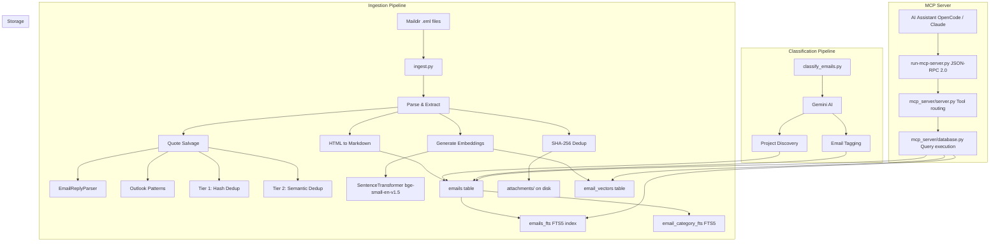
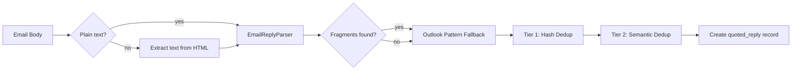
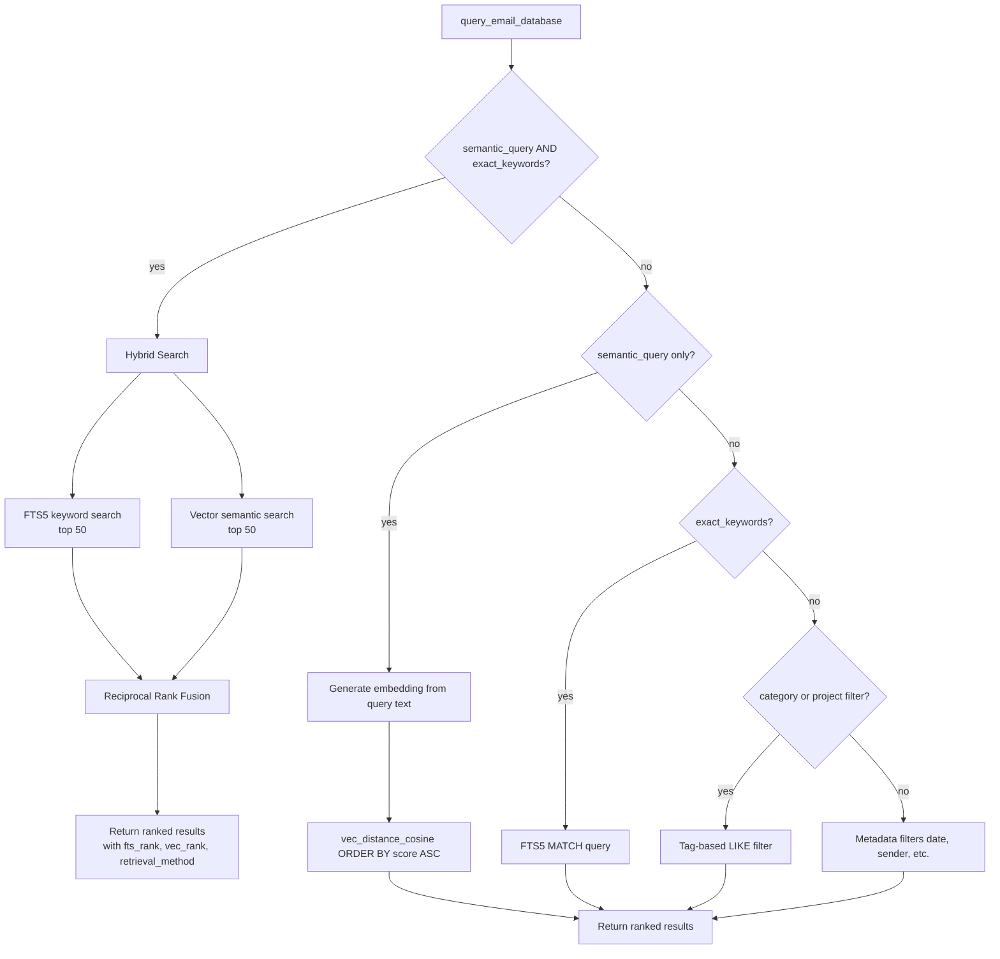
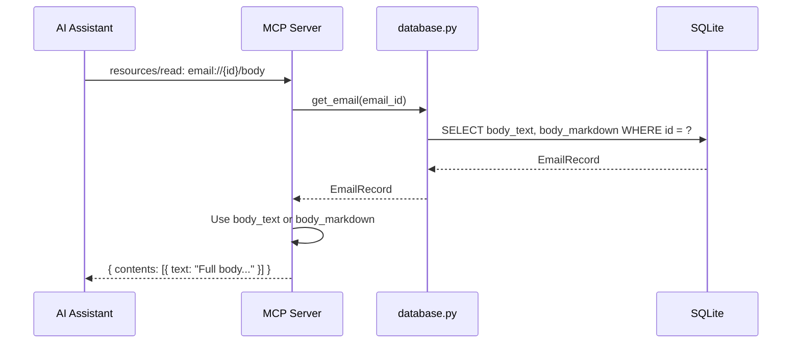
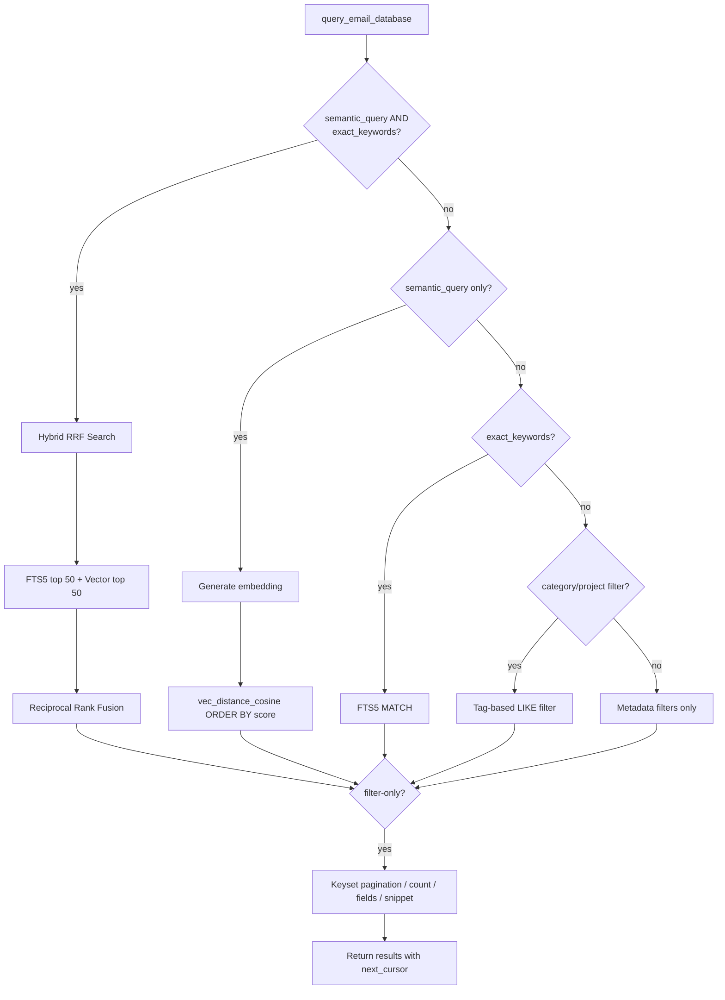
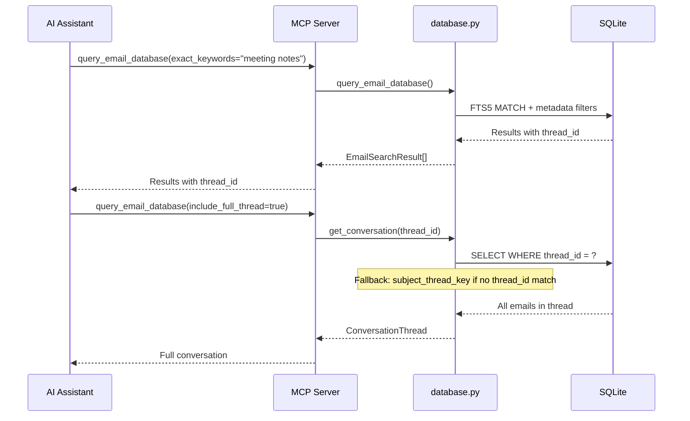
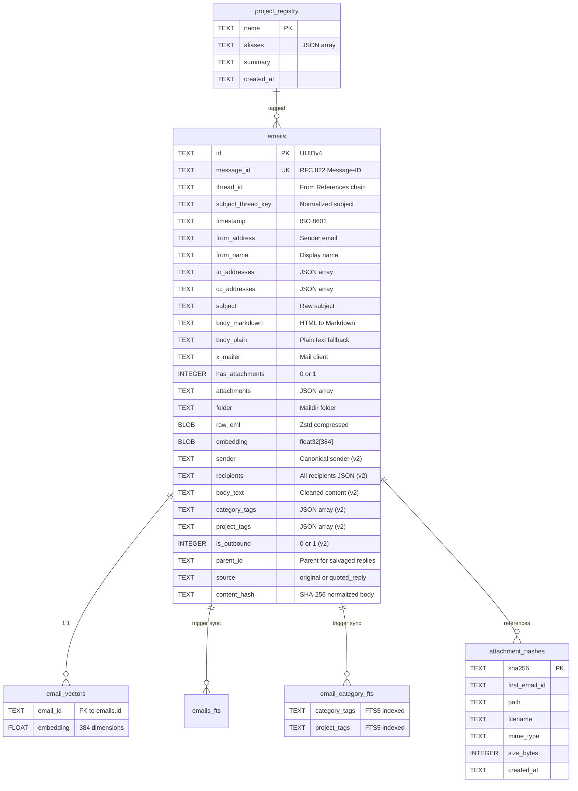

# Email Intelligence System (emailindex)


A powerful indexing and search engine for Maildir email archives. Combines traditional full-text search with modern semantic vector search, exposed via the Model Context Protocol (MCP) for AI assistants.

---

## At a Glance

| | |
|---|---|
| 🗄️ **Storage** | SQLite with FTS5 + sqlite-vec |
| 🧠 **Embeddings** | 384-dimensional via BAAI/bge-small-en-v1.5 |
| 🔍 **Search** | Vector similarity + Full-text (BM25) + Tag filters |
| 🧵 **Threading** | RFC 822 References/In-Reply-To with subject fallback |
| 📎 **Attachments** | SHA-256 deduplicated, stored once on disk |
| 💬 **Quote Salvage** | Extracts quoted replies with 2-tier dedup (hash + semantic) |
| 🤖 **AI Classification** | Gemini-powered project discovery + email tagging |
| 🔌 **Protocol** | MCP (JSON-RPC 2.0 over stdio) |

---

## Features

- **Semantic Vector Search**: True semantic similarity search using `BAAI/bge-small-en-v1.5` embeddings (384-dim) with `sqlite-vec` for efficient cosine distance ranking.
- **Full-Text Search (FTS5)**: SQLite FTS5 with BM25 ranking for exact keyword matching.
- **Intelligent Threading**: Reconstructs conversation threads using RFC 822 References/In-Reply-To chains with subject-based fallback for emails missing standard headers.
- **Deduplicated Attachments**: SHA-256 based deduplication ensures that multiple copies of the same file across different emails only occupy space once.
- **Quote Salvage**: Extracts quoted reply blocks from inline email text using EmailReplyParser + custom Outlook pattern detection, with two-tier deduplication (hash-based + semantic similarity at 0.98 threshold).
- **HTML Body Support**: Salvages quoted replies from HTML-only emails (no plain text part) by extracting text while preserving Outlook quote structure.
- **Resumable Ingestion**: Batch-based ingestion pipeline with checkpointing and error recovery.
- **Parallel Ingestion**: ThreadPoolExecutor-based parsing with per-worker DB connections, configurable via `--concurrent-limit` (default: 4).
- **Concurrency Support**: Thread-local database connections for safe parallel MCP requests and ingestion workers.
- **Model Context Protocol (MCP)**: Exposes search and retrieval tools directly to AI assistants like Claude Desktop or OpenCode.
- **AI-Powered Classification**: Gemini-based project discovery and email tagging with checkpoint-based resumption.
- **Project Context**: Tag-based email categorization with project registry for contextual AI queries.

---

## Architecture



### System Components

| Component | File | Purpose |
|-----------|------|---------|
| MCP Entry Point | `run-mcp-server.py` | JSON-RPC 2.0 protocol wrapper, stdio transport |
| Server Logic | `mcp_server/server.py` | Tool definitions, request routing, schema validation |
| Database Layer | `mcp_server/database.py` | SQLite queries, vector search, lazy embedding model |
| Data Models | `mcp_server/models.py` | Pydantic validation (EmailRecord, SearchParams, etc.) |
| Configuration | `mcp_server/config.py` | Paths, model settings, embedding dimensions |
| Ingestion | `ingest.py` | Maildir parsing, embedding generation, quote salvage, storage |
| Classification | `classify_emails.py` | Gemini-powered project discovery & email tagging |
| Quote Salvage | `salvage_quotes.py` | Standalone re-salvage tool for already-ingested emails |
| Migration | `ingest.py --backfill` | Schema migration + backfill for v2 columns (tags, threading) |

---

## Tech Stack

| Category | Technology |
|----------|------------|
| **Language** |  |
| **Database** |  + FTS5 + [sqlite-vec](https://github.com/asg017/sqlite-vec) |
| **Embeddings** | [Sentence-Transformers](https://www.sbert.net/) — `BAAI/bge-small-en-v1.5` (384-dim) |
| **AI** | [Google Gemini](https://ai.google.dev/) — Project discovery & classification |
| **Parsing** | [BeautifulSoup4](https://www.crummy.com/software/BeautifulSoup/) + [Markdownify](https://github.com/matthewwithanm/python-markdownify) |
| **Quote Detection** | [Email Reply Parser](https://github.com/WillStedden/email-reply-parser) + custom Outlook regex |
| **Validation** | [Pydantic v2](https://docs.pydantic.dev/) |
| **Compression** | [Zstandard](https://github.com/facebook/zstd) for raw email storage |
| **Testing** | [pytest](https://docs.pytest.org/) + custom validation scripts |

---

## Getting Started

### 1. Installation

```bash
python3 -m venv .venv
source .venv/bin/activate
pip install -r requirements.txt
```

### 2. Ingestion

```bash
# Default (4 parallel workers)
python3 ingest.py /path/to/your/maildir

# Custom concurrency
python3 ingest.py /path/to/your/maildir --concurrent-limit 2
python3 ingest.py /path/to/your/maildir --concurrent-limit 8

# Start fresh (no resume)
python3 ingest.py /path/to/your/maildir --no-resume
```

This will:
1. Parse all `.eml` files from your Maildir using parallel workers
2. Convert HTML bodies to clean Markdown
3. Extract quoted reply blocks and salvage them as separate records
4. Generate 384-dimensional semantic embeddings (batch-encoded on main thread)
5. Compress and store raw email content with zstd
6. Deduplicate attachments to `attachments/`
7. Build FTS5 index and populate vector database

**Parallel Ingestion Details:**
- Workers parse emails independently with per-thread SQLite connections
- SQLite WAL mode enabled for safe concurrent access
- Embedding model loaded once on main thread, batch-encodes for efficiency
- Thread-safe checkpoint tracking with `threading.Lock`
- Duplicate detection before embedding work (saves computation)

### 3. AI Classification (Optional)

```bash
export GEMINI_API_KEY="your-api-key"
python3 classify_emails.py
```

Auto-discovers projects from email content and tags emails with `category_tags` and `project_tags`. Supports checkpoint-based resumption.

### 4. MCP Server

```bash
python3 run-mcp-server.py --stdio
```

The wrapper script handles JSON-RPC 2.0 protocol handshake (`initialize`, `initialized`) and response formatting.

---

## Quote Salvage

The quote salvage system extracts quoted reply blocks from inline email text and stores them as separate `source='quoted_reply'` records linked to their parent email via `parent_id`.

### How It Works



1. **EmailReplyParser**: Parses standard email reply structures to identify quoted fragments
2. **Outlook Pattern Fallback**: Custom regex detection for Outlook-style quote blocks (`From: ... Sent: ... To: ... Subject: ...`)
3. **Tier 1 — Hash Dedup**: SHA-256 hash of normalized content (signatures stripped, lowercased, whitespace collapsed)
4. **Tier 2 — Semantic Dedup**: Cosine similarity >= 0.98 within the same thread using sentence embeddings

### HTML-Only Emails

For emails with no plain text part (HTML-only), the system extracts text content using Beautiful Soup while preserving structural elements needed for quote pattern detection.

### Post-Ingestion Salvage

To re-salvage quotes from already-ingested emails (e.g., after improving the salvage algorithm):

```bash
python3 salvage_quotes.py
```

---

## MCP Client Integration

### OpenCode

```json
{
  "mcp": {
    "emailindex": {
      "type": "local",
      "command": [
        "/path/to/emailindex/.venv/bin/python3",
        "/path/to/emailindex/run-mcp-server.py"
      ],
      "enabled": true
    }
  }
}
```

### Claude Desktop

```json
{
  "mcpServers": {
    "emailindex": {
      "command": ["/path/to/emailindex/.venv/bin/python3", "/path/to/emailindex/run-mcp-server.py"],
      "env": {
        "PYTHONPATH": "/path/to/emailindex"
      }
    }
  }
}
```

---

## MCP Tools

The server exposes **9 tools** for AI assistants:

### `query_email_database`

Unified email search with three modes: keyword-only (FTS5), semantic-only (vector), or **hybrid** (both combined via Reciprocal Rank Fusion).



**Parameters:**

| Parameter | Type | Description |
|-----------|------|-------------|
| `semantic_query` | string | Vector search text — generates embedding at query time. When combined with `exact_keywords`, triggers hybrid RRF search (see [wiki](https://github.com/thomasmaerz/emailindex/wiki/Hybrid-Search-with-Reciprocal-Rank-Fusion)). |
| `exact_keywords` | string | FTS5 exact keyword match. When combined with `semantic_query`, triggers hybrid RRF search (see [wiki](https://github.com/thomasmaerz/emailindex/wiki/Hybrid-Search-with-Reciprocal-Rank-Fusion)). |
| `category_filter` | string | Comma-separated category tags |
| `project_filter` | string | Comma-separated project tags |
| `date_from` | string | Start date (ISO 8601) |
| `date_to` | string | End date (ISO 8601) |
| `from_address` | string | Filter by sender |
| `from_name` | string | Filter by sender display name (LIKE match) |
| `to_address` | string | Filter by recipient |
| `is_outbound` | boolean | Filter by direction |
| `has_attachments` | boolean | Filter by attachments |
| `limit` | integer | Max results (1-50, default: 10) |
| `include_full_thread` | boolean | Return full conversation thread |
| `sort_by` | string | Sort by `timestamp` or `relevance`. Auto-defaults based on query type. |
| `sort_order` | string | Sort order `asc` or `desc`. Default: `desc`. |
| `count_only` | boolean | Return only count, no results |
| `fields` | array | Specific fields to return (field projection) |
| `snippet_only` | boolean | Return FTS5 snippet instead of full body |
| `snippet_length` | integer | FTS5 snippet token window size (default: 32) |
| `cursor` | string | Opaque pagination cursor from previous response |

**Example:**
```python
# Find emails about project planning
query_email_database(semantic_query="quarterly planning meeting", limit=10)

# Exact keyword search with filters
query_email_database(
    exact_keywords="invoice",
    date_from="2024-01-01",
    date_to="2024-12-31",
    has_attachments=True
)

# Cursor pagination
results = query_email_database(exact_keywords="report", limit=20)
next_cursor = results.get("next_cursor")
if next_cursor:
    page2 = query_email_database(exact_keywords="report", limit=20, cursor=next_cursor)

# Field projection (return only specific fields)
query_email_database(exact_keywords="budget", fields=["id", "subject", "timestamp", "from_address"])

# Count only (no results)
query_email_database(category_filter="work", count_only=True)
# Returns: {"count": 142}

# FTS5 snippets only (lighter response)
query_email_database(exact_keywords="meeting", snippet_only=True, snippet_length=64)

# Hybrid search: semantic + keyword combined via Reciprocal Rank Fusion
query_email_database(
    semantic_query="confused no idea what is going on",
    exact_keywords="confused",
    limit=10
)
# Results include fts_rank, vec_rank, and retrieval_method ("both", "fts", or "vector")
```

### `get_project_context`

Get project metadata and related emails from the project registry.

**Parameters:**

| Parameter | Type | Description |
|-----------|------|-------------|
| `project_name` | string | Project name or alias (required) |
| `limit` | integer | Max emails to return (1-50, default: 10) |

**Example:**
```python
get_project_context(project_name="ProjectAlpha", limit=10)
# Returns: { "project": {...}, "emails": [...] }
```

### `get_email_by_id`

Fetch a specific email by its UUID. Use when you have an email ID from a search result and need the full record.

**Parameters:**

| Parameter | Type | Description |
|-----------|------|-------------|
| `email_id` | string | UUIDv4 of the email (required) |

**Example:**
```python
get_email_by_id(email_id="550e8400-e29b-41d4-a716-446655440000")
# Returns: Full EmailRecord with body_markdown, attachments, etc.
```

### `get_thread_by_id`

Fetch all emails in a conversation thread by thread ID. Returns full conversation with metadata.

**Parameters:**

| Parameter | Type | Description |
|-----------|------|-------------|
| `thread_id` | string | Thread ID (format: thread-*) (required) |
| `limit` | integer | Max emails to return (1-50, default: 50) |

**Example:**
```python
get_thread_by_id(thread_id="thread-abc123def456")
# Returns: { "thread_id": "...", "subject": "...", "emails": [...] }
```

### `list_projects`

List all projects in the registry. Use to discover available projects before filtering by project_filter.

**Parameters:**

| Parameter | Type | Description |
|-----------|------|-------------|
| `limit` | integer | Max projects to return (1-50, default: 20) |

**Example:**
```python
list_projects()
# Returns: { "projects": [...], "count": N }
```

### `get_mention_timeline`

Get a timeline of keyword mentions grouped by year, month, or quarter. Useful for tracking when topics or people were discussed over time.

**Parameters:**

| Parameter | Type | Description |
|-----------|------|-------------|
| `keyword` | string | Exact keyword or name to search (required) |
| `semantic_query` | string | Optional semantic variant for vector search |
| `granularity` | string | Grouping: `year`, `month`, or `quarter` (default: `year`) |
| `date_from` | string | Start date (ISO 8601) |
| `date_to` | string | End date (ISO 8601) |
| `from_address` | string | Filter by sender |
| `is_outbound` | boolean | Filter by direction |

**Example:**
```python
# Track mentions of "budget" by month in 2024
get_mention_timeline(keyword="budget", granularity="month", date_from="2024-01-01", date_to="2024-12-31")
# Returns: { "timeline": [{"period": "2024-01", "count": 5}, ...] }
```

### `get_contact_profile`

Get a contact profile with interaction history, statistics, and sample emails. Identifies contacts by name or email address.

**Parameters:**

| Parameter | Type | Description |
|-----------|------|-------------|
| `name` | string | Fuzzy match on sender display name |
| `email_address` | string | Exact or partial match on sender email |
| `limit` | integer | Representative emails to return (1-50, default: 10) |
| `include_timeline` | boolean | Include mention timeline (default: `true`) |

**Example:**
```python
# Profile by email
get_contact_profile(email_address="alice@company.com", limit=5)
# Returns: { "contact": { "name", "email", "total_emails", "first_seen", "last_seen", ... }, "emails": [...], "timeline": [...] }

# Profile by name (fuzzy)
get_contact_profile(name="Alice Smith")
```

### `get_thread_arc`

Get a thread arc showing messages in a conversation with participant info. Two modes: `summary` (lightweight overview) or `full` (detailed message list).

**Parameters:**

| Parameter | Type | Description |
|-----------|------|-------------|
| `thread_id` | string | Thread ID from query result (required) |
| `mode` | string | `summary` or `full` (default: `summary`) |
| `max_messages` | integer | Max messages to return (1-50, default: 20) |

**Example:**
```python
# Quick thread overview
get_thread_arc(thread_id="thread-abc123", mode="summary")
# Returns: { "thread_id", "subject", "participants": [...], "message_count", "date_range", "overview": "..." }

# Full message list
get_thread_arc(thread_id="thread-abc123", mode="full", max_messages=10)
# Returns: { "thread_id", "messages": [{ "id", "from", "timestamp", "subject", "snippet" }, ...] }
```

### `list_threads`

List all conversation threads sorted by various metrics. Useful for discovering the most active or largest threads.

**Parameters:**

| Parameter | Type | Description |
|-----------|------|-------------|
| `sort_by` | string | Sort field: `message_count`, `participant_count`, `last_activity`, `first_activity` (default: `message_count`) |
| `sort_order` | string | Sort order: `asc` or `desc` (default: `desc`) |
| `limit` | integer | Max threads to return (1-50, default: 10) |

**Example:**
```python
# Most active threads
list_threads(sort_by="message_count", sort_order="desc", limit=10)

# Most recently active threads
list_threads(sort_by="last_activity", limit=5)
# Returns: { "threads": [{ "thread_id", "subject", "message_count", "participant_count", ... }], "count": N }
```

---

## MCP Resources

The server exposes email bodies as MCP Resources for direct access without loading full email records.

### `email://{email_id}/body`

Returns the full body text of an email as `text/markdown`. Use the `email_id` from any query result.



**Example:**
```
# Request
resources/read: { "uri": "email://550e8400-e29b-41d4-a716-446655440000/body" }

# Response
{ "contents": [{ "uri": "email://.../body", "mimeType": "text/markdown", "text": "Full email body text..." }] }
```

This is more efficient than `get_email_by_id` when you only need the body text.

### Unified Query Flow


```

---

## Search Architecture

### Vector Search Flow


### Threading Flow



---

## Database Schema

### Core Tables



---

## Post-Ingestion Tools

| Tool | Purpose |
|------|---------|
| `salvage_quotes.py` | Re-salvage quoted replies from already-ingested emails (e.g., after improving the salvage algorithm) |
| `classify_emails.py` | Run AI-powered project discovery and email tagging (requires `GEMINI_API_KEY`) |
| `ingest.py --backfill` | Apply schema migrations and backfill missing data (replaces `migrate_v2.py`) |

---

## Testing

The project includes both integration validation scripts and pytest-based unit tests.

### Unit Tests (pytest)

```bash
pytest tests/test_quote_salvage.py -v
pytest tests/test_mcp_tools.py -v
pytest tests/test_thread_arc.py -v
pytest tests/test_contact_profile.py -v
pytest tests/test_cursor_pagination.py -v
pytest tests/test_field_projection.py -v
pytest tests/test_mention_timeline.py -v
pytest tests/test_query_extensions.py -v
pytest tests/test_blob_exclusion.py -v
pytest tests/test_classify_pagination.py -v
```

Covers:
- Outlook quote pattern detection
- EmailReplyParser integration
- Tier 1 (hash) deduplication
- Tier 2 (semantic similarity) deduplication
- HTML-only email salvage
- MCP tool responses and schema validation
- Thread arc summary/full modes
- Contact profile aggregation
- Cursor-based pagination
- Field projection and response optimization
- Blob exclusion (raw_eml, embedding not leaked)
- Classification pagination
- End-to-end integration

### Integration Validation

```bash
python tests/run_all_validations.py           # Summary
python tests/run_all_validations.py --verbose # Detailed
python tests/run_all_validations.py --json    # Machine-readable
```

Validates:
- Maildir-to-DB field fidelity
- Attachment pipeline integrity
- Vector/embedding coverage
- Content hash uniqueness
- Parent-child relationships
- MCP query filters

---

## Troubleshooting

### MCP Connection Timeout

**Symptom:** "Operation timed out after 30000ms"

**Solutions:**
1. Use `run-mcp-server.py` (not `-m mcp_server.server`) — it handles the JSON-RPC 2.0 handshake
2. Check `/tmp/mcp_start.log` for server logs
3. Test handshake: `echo '{"jsonrpc":"2.0","id":1,"method":"initialize"}' | python3 run-mcp-server.py`

### Schema Validation Failure

**Symptom:** Server exits with "Missing required v2 columns"

**Solution:** Run the backfill:
```bash
python3 ingest.py /path/to/maildir --backfill
```

### sqlite-vec Issues

**Symptom:** `ModuleNotFoundError: No module named 'sqlite_vec'`

```bash
pip install sqlite-vec
```

### Vector Embeddings Not Working

**Check:**
```bash
sqlite3 db/emails.db "SELECT COUNT(*) FROM emails WHERE embedding IS NOT NULL;"
```
If 0, re-run ingestion to generate embeddings.

---

## Security

- **Parameterized Queries**: All database operations protected against SQL injection
- **Path Sanitization**: Attachment filenames sanitized to prevent traversal attacks
- **Strict Input Validation**: Pydantic models validate UUIDs, email addresses, and thread IDs
- **Schema Validation**: Server fails fast on startup if database schema is incompatible

---

## License

MIT
