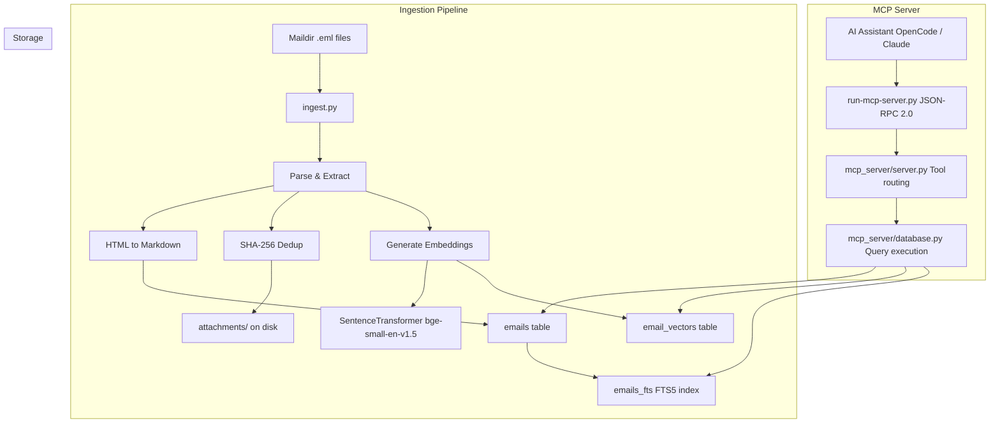
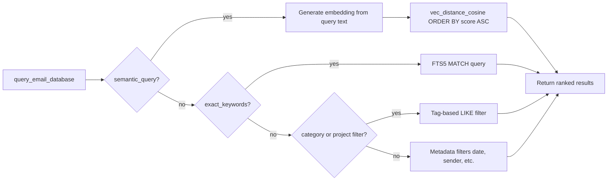
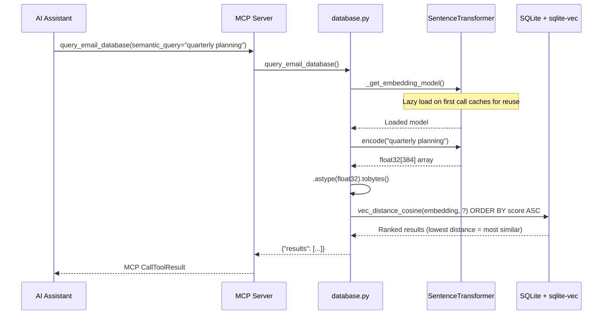
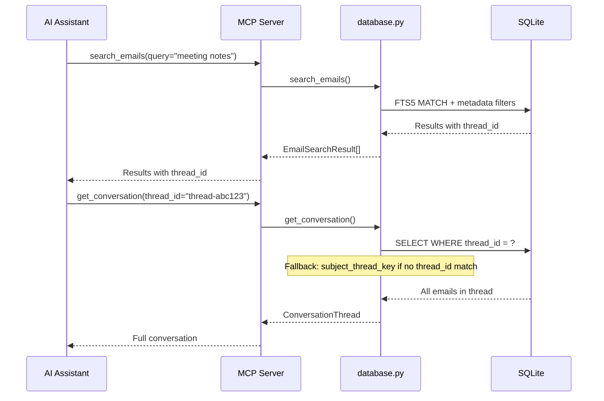
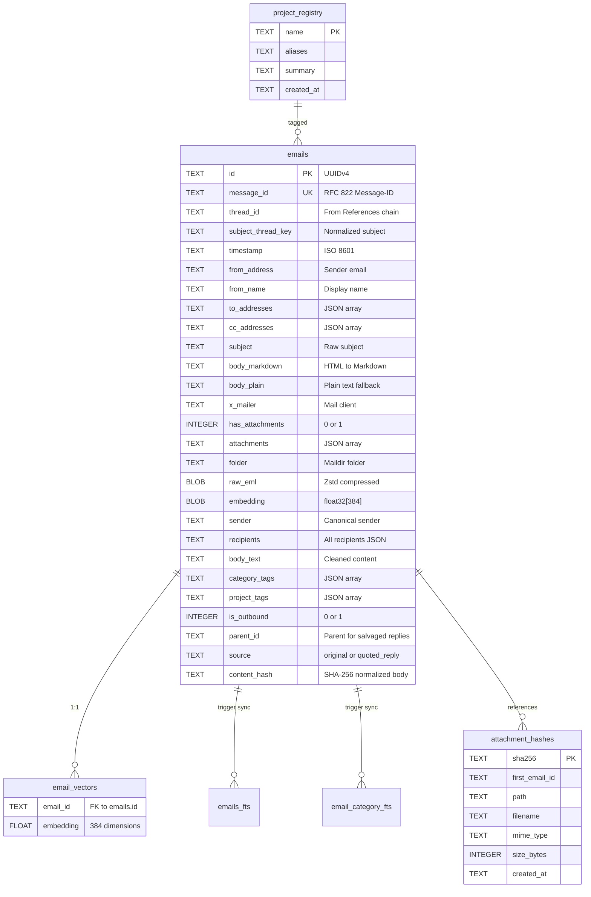

# Email Intelligence System (emailindex)

**Email Intelligence System** is a powerful indexing and search engine for 12+ years of Maildir archives. It combines traditional full-text search with modern semantic vector search, exposed via the Model Context Protocol (MCP).

---

## Features

- **Semantic Vector Search**: True semantic similarity search using `BAAI/bge-small-en-v1.5` embeddings (384-dim) with `sqlite-vec` for efficient cosine distance ranking.
- **Full-Text Search (FTS5)**: SQLite FTS5 with BM25 ranking for exact keyword matching.
- **Intelligent Threading**: Reconstructs conversation threads using RFC 822 References/In-Reply-To chains with subject-based fallback for emails missing standard headers.
- **Deduplicated Attachments**: SHA-256 based deduplication ensures that multiple copies of the same file across different emails only occupy space once.
- **Resumable Ingestion**: Batch-based ingestion pipeline with checkpointing and error recovery.
- **Concurrency Support**: Thread-local database connections for safe parallel MCP requests.
- **Model Context Protocol (MCP)**: Exposes search and retrieval tools directly to AI assistants like Claude Desktop or OpenCode.
- **Project Context**: Tag-based email categorization with project registry for contextual AI queries.

---

## Architecture



### System Components

| Component | File | Purpose |
|-----------|------|---------|
| MCP Entry Point | `run-mcp-server.py` | JSON-RPC 2.0 protocol wrapper, stdio transport |
| Server Logic | `mcp_server/server.py` | Tool definitions, request routing, schema validation |
| Database Layer | `mcp_server/database.py` | SQLite queries, vector search, lazy embedding model |
| Data Models | `mcp_server/models.py` | Pydantic validation (EmailRecord, SearchParams, etc.) |
| Configuration | `mcp_server/config.py` | Paths, model settings, embedding dimensions |
| Ingestion | `ingest.py` | Maildir parsing, embedding generation, storage |
| Migration | `migrate_v2.py` | Schema migration for v2 columns (tags, threading) |

---

## Tech Stack

- **Python 3.12+**
- **Conda** (Recommended for dependency management)
- **SQLite** with `fts5` and `sqlite-vec` extensions
- **Sentence-Transformers** (`BAAI/bge-small-en-v1.5`)
- **Pydantic v2** for robust data validation
- **Zstandard** for email body compression
- **BeautifulSoup4 & Markdownify** for HTML-to-Markdown conversion

---

## Getting Started

### 1. Installation (Conda Recommended)

```bash
conda create -n emailindex python=3.12 -y
conda activate emailindex
pip install -r requirements.txt
```

### 2. Ingestion

```bash
python3 ingest.py /path/to/your/maildir
```

This will:
1. Parse all `.eml` files from your Maildir
2. Generate 384-dimensional semantic embeddings
3. Compress and store raw email content with zstd
4. Deduplicate attachments to `attachments/`
5. Build FTS5 index and populate vector database

### 3. MCP Server

```bash
python3 run-mcp-server.py --stdio
```

The wrapper script handles JSON-RPC 2.0 protocol handshake (`initialize`, `initialized`) and response formatting.

---

## MCP Client Integration

### OpenCode

```json
{
  "mcp": {
    "emailindex": {
      "type": "local",
      "command": [
        "/path/to/miniconda3/envs/emailindex/bin/python3",
        "/path/to/emailindex/run-mcp-server.py"
      ],
      "enabled": true
    }
  }
}
```

### Claude Desktop

```json
{
  "mcpServers": {
    "emailindex": {
      "command": ["/path/to/miniconda3/envs/emailindex/bin/python3", "/path/to/emailindex/run-mcp-server.py"],
      "env": {
        "PYTHONPATH": "/path/to/emailindex"
      }
    }
  }
}
```

---

## MCP Tools

The server exposes **2 tools** for AI assistants:

### `query_email_database`

Unified email search with multiple strategies:



**Parameters:**

| Parameter | Type | Description |
|-----------|------|-------------|
| `semantic_query` | string | Vector search text - generates embedding at query time |
| `exact_keywords` | string | FTS5 exact keyword match |
| `category_filter` | string | Comma-separated category tags |
| `project_filter` | string | Comma-separated project tags |
| `date_from` | string | Start date (ISO 8601) |
| `date_to` | string | End date (ISO 8601) |
| `from_address` | string | Filter by sender |
| `to_address` | string | Filter by recipient |
| `is_outbound` | boolean | Filter by direction |
| `has_attachments` | boolean | Filter by attachments |
| `limit` | integer | Max results (1-50, default: 10) |
| `include_full_thread` | boolean | Return full conversation thread |

### `get_project_context`

Get project metadata and related emails from the project registry.

**Parameters:**

| Parameter | Type | Description |
|-----------|------|-------------|
| `project_name` | string | Project name or alias (required) |
| `limit` | integer | Max emails to return (1-50, default: 10) |

---

## Search Architecture

### Vector Search Flow



### Threading Flow



---

## Database Schema

### Core Tables



---

## Troubleshooting

### MCP Connection Timeout

**Symptom:** "Operation timed out after 30000ms"

**Solutions:**
1. Use `run-mcp-server.py` (not `-m mcp_server.server`) - it handles the JSON-RPC 2.0 handshake
2. Check `/tmp/mcp_start.log` for server logs
3. Test handshake: `echo '{"jsonrpc":"2.0","id":1,"method":"initialize"}' | python3 run-mcp-server.py`

### Schema Validation Failure

**Symptom:** Server exits with "Missing required v2 columns"

**Solution:** Run the migration:
```bash
python3 migrate_v2.py
```

The server validates the schema on startup and will fail fast with a clear error message if v2 columns are missing.

### sqlite-vec Issues

**Symptom:** `ModuleNotFoundError: No module named 'sqlite_vec'`

```bash
conda install -c conda-forge sqlite-vec
# or
pip install sqlite-vec
```

### Vector Embeddings Not Working

**Check:**
```bash
sqlite3 db/emails.db "SELECT COUNT(*) FROM emails WHERE embedding IS NOT NULL;"
```
If 0, re-run ingestion to generate embeddings.

---

## Security

- **Parameterized Queries**: All database operations protected against SQL injection
- **Path Sanitization**: Attachment filenames sanitized to prevent traversal attacks
- **Strict Input Validation**: Pydantic models validate UUIDs, email addresses, and thread IDs
- **Schema Validation**: Server fails fast on startup if database schema is incompatible

---

## License

MIT
