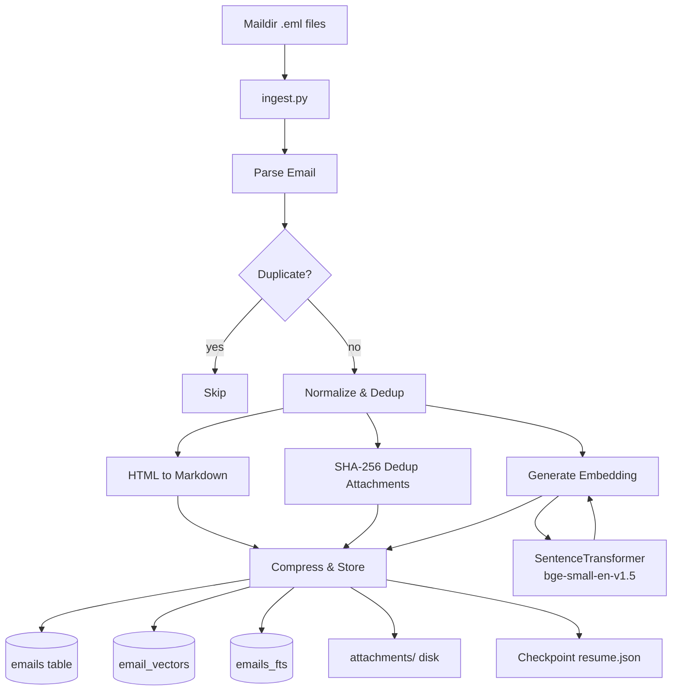
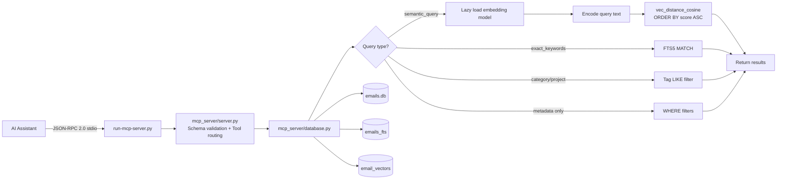
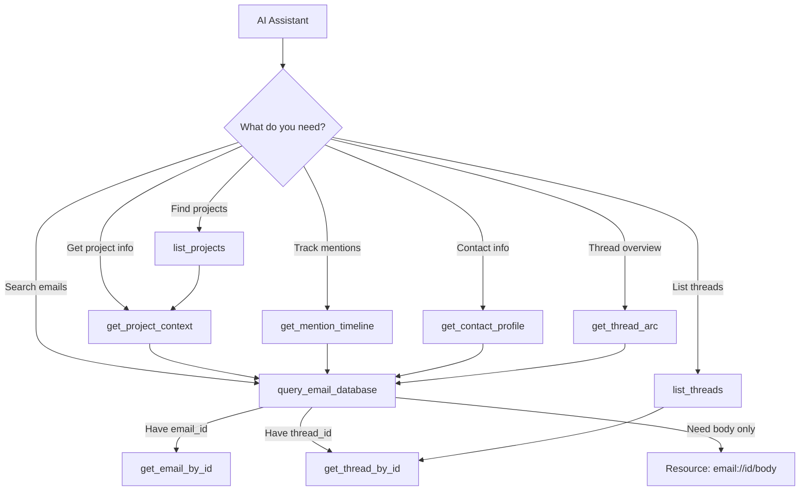

# Email Intelligence System - Project Scaffold

**Version:** 2.0.0  
**Last Updated:** 2026-04-02  
**Status:** Production - v2 schema with vector search

---

## 1. Directory Structure

```
emailindex/
├── attachments/                          # All email attachments stored on disk
│   └── {YYYY}/                          # Year folders (e.g., 2015, 2016, ...)
│       └── {MM_Mon}/                    # Month folders (e.g., 01_Jan, 02_Feb, ...)
│           └── {thread_id}/              # Thread-scoped subdirectory
│               └── {filename}            # Deduplicated by SHA-256 hash
│
├── db/                                  # Database directory
│   └── emails.db                        # Main SQLite database with sqlite-vec
│
├── ingestion/                           # Ingestion pipeline artifacts
│   ├── resume.json                      # Checkpoint file for resumable ingestion
│   └── logs/                            # Ingestion and validation logs
│       ├── ingestion_{YYYYMMDD}.log
│       └── validation_{YYYYMMDD_HHMMSS}.log
│
├── maildir/                             # SOURCE: User's Maildir archive (input only)
│
├── mcp_server/                          # MCP server package
│   ├── __init__.py                      # Package init (empty)
│   ├── server.py                        # Main MCP server entry point + schema validation
│   ├── database.py                      # SQLite queries, lazy embedding model, vector search
│   ├── models.py                        # Pydantic models (EmailRecord, AttachmentRecord, etc.)
│   └── config.py                        # Configuration constants
│
├── tests/                               # Test suite
│   ├── run_all_validations.py           # Unified test runner
│   ├── validate_extraction_pipeline.py  # Email extraction quality
│   ├── validate_attachments.py          # Attachment pipeline
│   ├── validate_body_text.py            # Body text validation
│   ├── validate_issue2.py               # Issue-specific validation
│   ├── validate_issue4.py               # Vector/embedding pipeline
│   ├── test_quote_salvage.py            # pytest: quote salvage
│   ├── test_mcp_tools.py                # pytest: MCP tools
│   ├── test_thread_arc.py               # pytest: thread arc
│   ├── test_contact_profile.py          # pytest: contact profile
│   ├── test_cursor_pagination.py        # pytest: pagination
│   ├── test_field_projection.py         # pytest: field projection
│   ├── test_mention_timeline.py         # pytest: mention timeline
│   ├── test_query_extensions.py         # pytest: query extensions
│   ├── test_blob_exclusion.py           # pytest: blob exclusion
│   ├── test_classify_pagination.py      # pytest: classification
│   ├── cleanup.py                       # Test cleanup
│   └── stress_test_runner.py            # Load testing
│
├── classify_emails.py                   # Batch classification script with Gemini
├── ingest.py                            # Main ingestion script (includes --backfill for v2 migration)
├── salvage_quotes.py                    # Standalone quote re-salvage tool
├── run-mcp-server.py                    # MCP entry point (JSON-RPC 2.0 wrapper)
├── run-mcp-server.sh                    # Shell script wrapper
├── requirements.txt                     # Python dependencies
├── AGENTS.md                            # AI assistant usage guide
└── README.md                            # Project overview and setup guide
```

---

## 2. SQLite Schema

### 2.1 Core Table (v2)

```sql
-- Main emails table (v2 schema)
CREATE TABLE IF NOT EXISTS emails (
    id TEXT PRIMARY KEY,                    -- UUIDv4, generated at ingest time
    message_id TEXT UNIQUE NOT NULL,        -- RFC 822 Message-ID, dedup key
    thread_id TEXT,                         -- From References/In-Reply-To chain
    subject_thread_key TEXT,                -- Normalized subject (Re:/Fwd: stripped)
    
    -- Timing and parties
    timestamp TEXT NOT NULL,                -- ISO 8601 (e.g., "2024-01-15T14:30:00Z")
    from_address TEXT NOT NULL,             -- Envelope sender email
    from_name TEXT,                         -- Display name (may be empty)
    to_addresses TEXT NOT NULL,             -- JSON array: ["a@b.com", "c@d.com"]
    cc_addresses TEXT,                      -- JSON array, nullable
    
    -- Content
    subject TEXT NOT NULL,                  -- Raw subject line
    body_markdown TEXT NOT NULL,            -- HTML->Markdown, main body text
    body_plain TEXT,                        -- Plain text fallback
    x_mailer TEXT,                          -- X-Mailer/User-Agent header
    
    -- Attachments
    has_attachments INTEGER NOT NULL DEFAULT 0,  -- 0 or 1, no booleans in SQLite
    attachments TEXT,                           -- JSON array: [{"filename": "...", "path": "...", "mime_type": "..."}]
    
    -- Storage
    folder TEXT NOT NULL,                   -- Maildir folder: "INBOX", "Sent", ".Drafts"
    raw_eml BLOB,                           -- Zstd-compressed original .eml bytes
    embedding BLOB,                         -- sqlite-vec float32[384] vector
    
    -- v2 columns (added by migrate_v2.py)
    sender TEXT,                            -- Canonical sender address
    recipients TEXT,                        -- All recipients as JSON array
    body_text TEXT,                         -- Cleaned content text
    category_tags TEXT,                     -- JSON array of category tags
    project_tags TEXT,                      -- JSON array of project tags
    is_outbound INTEGER,                    -- 1 if sender is user, 0 otherwise
    parent_id TEXT,                         -- UUID of parent for salvaged replies
    source TEXT DEFAULT 'original',         -- 'original' or 'quoted_reply'
    content_hash TEXT,                      -- SHA-256 of normalized body
    
    -- Constraints
    CONSTRAINT message_id_not_empty CHECK (message_id <> '')
);

-- Indexes for common query patterns
CREATE INDEX IF NOT EXISTS idx_emails_timestamp ON emails(timestamp);
CREATE INDEX IF NOT EXISTS idx_emails_thread_id ON emails(thread_id);
CREATE INDEX IF NOT EXISTS idx_emails_subject_thread_key ON emails(subject_thread_key);
CREATE INDEX IF NOT EXISTS idx_emails_from_address ON emails(from_address);
CREATE INDEX IF NOT EXISTS idx_emails_folder ON emails(folder);
CREATE INDEX IF NOT EXISTS idx_emails_content_hash ON emails(content_hash);
CREATE INDEX IF NOT EXISTS idx_emails_project_search ON emails(timestamp, sender, category_tags);

-- Full-text search on subject and body
CREATE VIRTUAL TABLE IF NOT EXISTS emails_fts USING fts5(
    subject,
    body_markdown,
    content='emails',
    content_rowid='rowid'
);

-- Triggers to keep FTS in sync
CREATE TRIGGER IF NOT EXISTS emails_fts_insert AFTER INSERT ON emails BEGIN
    INSERT INTO emails_fts(rowid, subject, body_markdown) VALUES (NEW.rowid, NEW.subject, NEW.body_markdown);
END;

CREATE TRIGGER IF NOT EXISTS emails_fts_delete AFTER DELETE ON emails BEGIN
    INSERT INTO emails_fts(emails_fts, rowid, subject, body_markdown) VALUES('delete', OLD.rowid, OLD.subject, OLD.body_markdown);
END;

CREATE TRIGGER IF NOT EXISTS emails_fts_update AFTER UPDATE ON emails BEGIN
    INSERT INTO emails_fts(emails_fts, rowid, subject, body_markdown) VALUES('delete', OLD.rowid, OLD.subject, OLD.body_markdown);
    INSERT INTO emails_fts(rowid, subject, body_markdown) VALUES (NEW.rowid, NEW.subject, NEW.body_markdown);
END;
```

### 2.2 Vector Search (sqlite-vec)

```sql
-- Vector search table for semantic similarity
-- bge-small-en-v1.5 produces 384-dimensional vectors
-- Note: ingest.py stores embeddings in both emails.embedding BLOB
-- and email_vectors for sqlite-vec operations

CREATE VIRTUAL TABLE IF NOT EXISTS email_vectors USING vec0(
    email_id TEXT,                          -- References emails.id
    embedding FLOAT[384]                    -- 384 dimensions for bge-small-en-v1.5
);
```

### 2.3 Full-Text Search (FTS5)

```sql
-- Full-text search on subject and body
CREATE VIRTUAL TABLE IF NOT EXISTS emails_fts USING fts5(
    subject,
    body_markdown,
    content='emails',
    content_rowid='rowid'
);

-- Triggers to keep FTS in sync
CREATE TRIGGER IF NOT EXISTS emails_fts_insert AFTER INSERT ON emails BEGIN
    INSERT INTO emails_fts(rowid, subject, body_markdown) VALUES (NEW.rowid, NEW.subject, NEW.body_markdown);
END;

CREATE TRIGGER IF NOT EXISTS emails_fts_delete AFTER DELETE ON emails BEGIN
    INSERT INTO emails_fts(emails_fts, rowid, subject, body_markdown) VALUES('delete', OLD.rowid, OLD.subject, OLD.body_markdown);
END;

CREATE TRIGGER IF NOT EXISTS emails_fts_update AFTER UPDATE ON emails BEGIN
    INSERT INTO emails_fts(emails_fts, rowid, subject, body_markdown) VALUES('delete', OLD.rowid, OLD.subject, OLD.body_markdown);
    INSERT INTO emails_fts(rowid, subject, body_markdown) VALUES (NEW.rowid, NEW.subject, NEW.body_markdown);
END;
```

### 2.4 Category & Project Tags FTS

```sql
-- FTS5 index for tag-based filtering
CREATE VIRTUAL TABLE IF NOT EXISTS email_category_fts USING fts5(
    category_tags,
    project_tags,
    content='emails'
);

-- Triggers to keep category FTS in sync
CREATE TRIGGER IF NOT EXISTS emails_ai AFTER INSERT ON emails BEGIN
    INSERT INTO email_category_fts(rowid, category_tags, project_tags) 
    VALUES (new.rowid, new.category_tags, new.project_tags);
END;

CREATE TRIGGER IF NOT EXISTS emails_ad AFTER DELETE ON emails BEGIN
    INSERT INTO email_category_fts(email_category_fts, rowid, category_tags, project_tags) 
    VALUES('delete', old.rowid, old.category_tags, old.project_tags);
END;

CREATE TRIGGER IF NOT EXISTS emails_au AFTER UPDATE ON emails BEGIN
    INSERT INTO email_category_fts(email_category_fts, rowid, category_tags, project_tags) 
    VALUES('delete', old.rowid, old.category_tags, old.project_tags);
    INSERT INTO email_category_fts(rowid, category_tags, project_tags) 
    VALUES (new.rowid, new.category_tags, new.project_tags);
END;
```

### 2.5 Attachment Tracking Table

```sql
-- Track SHA-256 hashes for deduplication
CREATE TABLE IF NOT EXISTS attachment_hashes (
    sha256 TEXT PRIMARY KEY,                -- SHA-256 hash of file content
    first_email_id TEXT,                    -- Email that first introduced this file
    path TEXT NOT NULL,                     -- Disk path to the stored file
    filename TEXT NOT NULL,                 -- Original filename
    mime_type TEXT,                         -- Detected MIME type
    size_bytes INTEGER NOT NULL,            -- File size
    created_at TEXT NOT NULL                -- ISO 8601 timestamp
);
```

### 2.6 Project Registry

```sql
-- Project metadata for contextual queries
CREATE TABLE IF NOT EXISTS project_registry (
    name TEXT PRIMARY KEY,                  -- Project name
    aliases TEXT,                           -- Alternative names (comma-separated)
    summary TEXT,                           -- Project description
    created_at TEXT                         -- ISO 8601 timestamp
);
```

---

## 3. Data Flow Diagram

### Ingestion Pipeline



### MCP Query Path



---

## 4. Key Engineering Decisions

### 4.1 SQLite over PostgreSQL/MySQL
- **Reason:** Single-file database simplifies backup, portability, and deployment
- **WAL mode:** Enabled for concurrent read/write access during parallel ingestion
- **Alternative considered:** DuckDB (no sqlite-vec support at time of design)

### 4.2 sqlite-vec for Vector Search
- **Reason:** Native SQLite extension, no separate vector DB needed
- **Trade-off:** Requires custom SQLite build with vec0 extension
- **Model choice (bge-small-en-v1.5):** 384 dims is manageable, local inference fast
- **Alternative considered:** pgvector (requires separate DB), OpenAI embeddings (API cost)

### 4.3 Attachments on Disk, Not BLOBs
- **Reason:** SQLite BLOBs > 1MB cause performance issues
- **Rationale:** Attachments can be large (images, PDFs), disk storage is more efficient
- **Deduplication:** SHA-256 ensures one copy per unique file across all emails

### 4.4 Zstd Compression for raw_eml
- **Reason:** Zstd offers best balance of compression ratio vs. speed
- **Typical ratio:** 3-5x for email content
- **Trade-off:** Slight CPU overhead on read (acceptable for occasional raw_eml access)

### 4.5 HTML→Markdown with Inline Image Replacement
- **Reason:** AI models understand Markdown better than HTML
- **Implementation:** beautifulsoup4 + markdownify chain
- **Inline images:** Convert to relative Markdown image refs for display

### 4.6 Thread ID Strategy
- **Primary:** References header chain (most accurate)
- **Fallback:** subject_thread_key (handles broken/missing headers)
- **Rationale:** Never merge into one field; different use cases need different granularity
- **Note:** Two emails with same thread_id ARE in same conversation; two emails with same subject_thread_key MIGHT be related

### 4.7 Batch Size of 500
- **Reason:** Balances checkpoint frequency vs. I/O overhead
- **Trade-off:** 500 emails ≈ 5-15 minutes depending on attachment sizes
- **Graceful shutdown:** resume.json enables exact pick-up point

### 4.8 stdio Transport for MCP
- **Reason:** Simplest integration for CLI tools and AI assistants
- **Alternative considered:** HTTP (more complex, less portable)
- **Trade-off:** No persistent connection (stateless requests)

---

## 5. Pydantic Models

### 5.1 EmailRecord

```python
# File: mcp_server/models.py

from __future__ import annotations
from datetime import datetime
from typing import Optional
from pydantic import BaseModel, Field, field_validator
import uuid


class AttachmentRecord(BaseModel):
    """Represents a single email attachment."""
    
    filename: str = Field(..., description="Original filename from email")
    path: str = Field(..., description="Relative path from emailindex/ directory")
    mime_type: str = Field(..., description="MIME type (e.g., 'image/png', 'application/pdf')")
    size_bytes: Optional[int] = Field(None, description="File size in bytes")
    sha256: Optional[str] = Field(None, description="SHA-256 hash for deduplication")
    
    @field_validator('path')
    @classmethod
    def path_must_be_relative(cls, v: str) -> str:
        if v.startswith('/'):
            raise ValueError("Attachment path must be relative to emailindex/")
        return v
    
    model_config = {
        "json_schema_extra": {
            "example": {
                "filename": "invoice.pdf",
                "path": "attachments/2024/01_Jan/abc123-thread/invoice.pdf",
                "mime_type": "application/pdf",
                "size_bytes": 45000,
                "sha256": "e3b0c44298fc1c149afbf4c8996fb92427ae41e4649b934ca495991b7852b855"
            }
        }
    }


class EmailRecord(BaseModel):
    """Complete email record as stored in SQLite."""
    
    id: str = Field(..., description="UUIDv4 primary key")
    message_id: str = Field(..., description="RFC 822 Message-ID header")
    thread_id: Optional[str] = Field(None, description="From References/In-Reply-To chain")
    subject_thread_key: str = Field(..., description="Normalized subject for fallback grouping")
    
    timestamp: str = Field(..., description="ISO 8601 timestamp")
    from_address: str = Field(..., description="Sender email address")
    from_name: Optional[str] = Field(None, description="Sender display name")
    to_addresses: list[str] = Field(..., description="Recipient email addresses")
    cc_addresses: Optional[list[str]] = Field(None, description="CC recipient addresses")
    
    subject: str = Field(..., description="Raw subject line")
    body_markdown: str = Field(..., description="HTML→Markdown converted body")
    body_plain: Optional[str] = Field(None, description="Plain text fallback")
    x_mailer: Optional[str] = Field(None, description="X-Mailer or User-Agent header")
    
    has_attachments: bool = Field(..., description="Whether email has attachments")
    attachments: list[AttachmentRecord] = Field(default_factory=list)
    
    folder: str = Field(..., description="Maildir folder name")
    raw_eml: Optional[bytes] = Field(None, description="Zstd-compressed raw .eml bytes")
    
    model_config = {
        "from_attributes": True,
        "json_schema_extra": {
            "example": {
                "id": "550e8400-e29b-41d4-a716-446655440000",
                "message_id": "<CAFq123@example.com>",
                "thread_id": "cafq123-thread-abc",
                "subject_thread_key": "meeting notes for q1 planning",
                "timestamp": "2024-01-15T14:30:00Z",
                "from_address": "alice@example.com",
                "from_name": "Alice Johnson",
                "to_addresses": ["bob@example.com", "charlie@example.com"],
                "cc_addresses": ["manager@example.com"],
                "subject": "Re: Meeting notes for Q1 Planning",
                "body_markdown": "# Meeting Notes\n\nWe discussed the quarterly goals...",
                "body_plain": "We discussed the quarterly goals...",
                "x_mailer": "Apple Mail (2.3456.8901.23)",
                "has_attachments": True,
                "attachments": [
                    {
                        "filename": "agenda.pdf",
                        "path": "attachments/2024/01_Jan/cafq123-thread-abc/agenda.pdf",
                        "mime_type": "application/pdf"
                    }
                ],
                "folder": "INBOX",
                "raw_eml": None
            }
        }
    }


class EmailSearchResult(BaseModel):
    """Simplified email record for search results."""
    
    id: str
    thread_id: Optional[str]
    subject: str
    timestamp: str
    from_address: str
    from_name: Optional[str]
    snippet: str = Field(..., description="Relevant text snippet from search")
    score: Optional[float] = Field(None, description="Relevance score for vector search")
    has_attachments: bool
    folder: str
    
    model_config = {"from_attributes": True}


class ConversationThread(BaseModel):
    """A complete conversation thread."""
    
    thread_id: str
    subject: str
    emails: list[EmailRecord] = Field(..., description="Emails sorted by timestamp")
    participant_count: int = Field(..., description="Number of unique participants")
    date_range: tuple[str, str] = Field(..., description="(earliest, latest) timestamps")
    attachment_count: int = Field(default=0, description="Total attachments in thread")
```

### 5.2 Search Parameters Model

```python
# File: mcp_server/models.py (continued)

class SearchParams(BaseModel):
    """Parameters for email search."""
    
    query: Optional[str] = Field(None, description="Full-text or semantic search query")
    date_from: Optional[str] = Field(None, description="Start date (ISO 8601 or YYYY-MM-DD)")
    date_to: Optional[str] = Field(None, description="End date (ISO 8601 or YYYY-MM-DD)")
    from_address: Optional[str] = Field(None, description="Filter by sender email")
    to_address: Optional[str] = Field(None, description="Filter by recipient email")
    has_attachments: Optional[bool] = Field(None, description="Filter by attachment presence")
    folder: Optional[str] = Field(None, description="Filter by Maildir folder")
    limit: int = Field(20, ge=1, le=1000, description="Maximum results to return")
    similar_to_email_id: Optional[str] = Field(
        None, 
        description="Find emails semantically similar to this email ID"
    )
    
    @field_validator('date_from', 'date_to', mode='before')
    @classmethod
    def parse_date(cls, v: Optional[str]) -> Optional[str]:
        if v is None:
            return None
        # Accept various date formats, return ISO 8601
        # Implementation delegates to dateutil.parser
        from dateutil import parser as date_parser
        try:
            dt = date_parser.parse(v)
            return dt.isoformat()
        except ValueError:
            raise ValueError(f"Invalid date format: {v}")
```

---

## 6. MCP Tools Specification

The server exposes **9 tools** via JSON-RPC 2.0 over stdio.

### 6.1 query_email_database

Unified email search with FTS5, vector similarity, and metadata filters.

```python
def query_email_database(
    semantic_query: str | None = None,     # Vector search text
    exact_keywords: str | None = None,     # FTS5 exact keyword match
    category_filter: str | None = None,    # Comma-separated category tags
    project_filter: str | None = None,     # Comma-separated project tags
    date_from: str | None = None,          # Start date (ISO 8601)
    date_to: str | None = None,            # End date (ISO 8601)
    from_address: str | None = None,       # Filter by sender
    from_name: str | None = None,          # Filter by sender display name (LIKE match)
    to_address: str | None = None,         # Filter by recipient
    is_outbound: bool | None = None,       # Filter by direction
    has_attachments: bool | None = None,   # Filter by attachments
    limit: int = 10,                       # Max results (1-50)
    include_full_thread: bool = False,     # Return full conversation thread
    sort_by: str | None = None,            # 'timestamp' or 'relevance'
    sort_order: str | None = None,         # 'asc' or 'desc'
    count_only: bool = False,              # Return only count
    fields: list[str] | None = None,       # Field projection
    snippet_only: bool = False,            # Return FTS5 snippet
    snippet_length: int = 32,              # Snippet token window size
    cursor: str | None = None              # Pagination cursor
) -> dict:
```

**Query Flow:**

```mermaid
flowchart TD
    A[query_email_database] --> B{semantic_query?}
    B -->|yes| C[Lazy load SentenceTransformer]
    C --> D[Encode query text to float32[384]]
    D --> E[vec_distance_cosine ORDER BY score ASC]
    E --> F[Return ranked results]
    
    B -->|no| G{exact_keywords?}
    G -->|yes| H[FTS5 MATCH query]
    H --> F
    
    G -->|no| I{category or project filter?}
    I -->|yes| J[Tag-based LIKE filter]
    J --> F
    
    I -->|no| K[Metadata filters]
    K --> F
```

### 6.2 get_project_context

Get project metadata and related emails from project registry.

```python
def get_project_context(
    project_name: str,    # Project name or alias (required)
    limit: int = 10       # Max emails to return (1-50)
) -> dict | None:
```

### 6.3 get_email_by_id

Fetch a specific email by UUID.

```python
def get_email_by_id(
    email_id: str         # UUIDv4 (required)
) -> dict | None:
```

### 6.4 get_thread_by_id

Fetch all emails in a conversation thread.

```python
def get_thread_by_id(
    thread_id: str        # Thread ID (format: thread-*) (required)
) -> dict | None:
```

### 6.5 list_projects

List all projects in the registry.

```python
def list_projects(
    limit: int = 20       # Max projects to return (1-50)
) -> dict:
```

### 6.6 get_mention_timeline

Get a timeline of keyword mentions grouped by year/month/quarter.

```python
def get_mention_timeline(
    keyword: str,                 # Exact keyword (required)
    semantic_query: str | None = None,  # Optional semantic variant
    granularity: str = "year",    # year, month, or quarter
    date_from: str | None = None,
    date_to: str | None = None,
    from_address: str | None = None,
    is_outbound: bool | None = None
) -> dict:
```

### 6.7 get_contact_profile

Get a contact profile with interaction history.

```python
def get_contact_profile(
    name: str | None = None,           # Fuzzy match on from_name
    email_address: str | None = None,  # Exact or partial match on from_address
    limit: int = 10,                   # Representative emails (1-50)
    include_timeline: bool = True      # Include mention timeline
) -> dict | None:
```

### 6.8 get_thread_arc

Get a thread arc with participant info.

```python
def get_thread_arc(
    thread_id: str,             # Thread ID (required)
    mode: str = "summary",      # summary or full
    max_messages: int = 20      # Max messages (1-50)
) -> dict | None:
```

### 6.9 list_threads

List all conversation threads sorted by metrics.

```python
def list_threads(
    sort_by: str = "message_count",       # message_count, participant_count, last_activity, first_activity
    sort_order: str = "desc",             # asc or desc
    limit: int = 10                       # Max threads (1-50)
) -> dict:
```

### Tool Interaction Map



---

## 7. Error Handling

Error handling is implemented directly in `ingest.py` with the following classes:
- `EncodingHandler` — handles malformed encoding in headers and bodies
- `HeaderHandler` — handles missing/malformed RFC 822 headers
- `ThreadHandler` — handles thread ID extraction and subject normalization
- `Converter` — handles HTML-to-Markdown conversion with inline image replacement

See `ingest.py` for the actual implementations.

---

## 8. Ingestion Batching

The ingestion pipeline in `ingest.py` supports:
- **Parallel processing** via `ThreadPoolExecutor` with configurable `--concurrent-limit` (default: 4)
- Per-worker SQLite connections with WAL mode for safe concurrent access
- Batch processing with checkpoint-based resumption (`ingestion/resume.json`)
- Resumable ingestion via `--backfill` flag (replaces standalone `migrate_v2.py`)
- Thread-safe checkpoint tracking with `threading.Lock`
- Thread-local database connections for safe parallel MCP requests

See `ingest.py` for the actual implementation. The checkpoint format is documented in `ingestion/resume.json`.

---

## 9. Dependencies

See `requirements.txt` for the current dependency list. Key dependencies:
- `sentence-transformers` — embedding generation (BAAI/bge-small-en-v1.5)
- `sqlite-vec` — vector search extension for SQLite
- `beautifulsoup4` + `markdownify` — HTML to Markdown conversion
- `pydantic` — data validation
- `zstandard` — raw email compression
- `email-reply-parser` — quote detection
- `google-genai` — Gemini-powered classification

---

## 10. Threading Algorithm

Thread ID construction is implemented in `ingest.py` via the `ThreadHandler` class:

1. **Primary:** `References` header chain (ordered Message-ID chain)
2. **Secondary:** `In-Reply-To` header (parent Message-ID)
3. **Fallback:** `subject_thread_key` (normalized subject with Re:/Fwd: stripped)

See `ingest.py` for the actual implementation.

---

## 11. Attachment Processing

Attachments are processed in `ingest.py`:
- SHA-256 deduplication ensures one copy per unique file
- Storage path: `attachments/{YYYY}/{MM_Mon}/{thread_id}/{filename}`
- Inline images (CID) converted to Markdown references in `body_markdown`
- `is_visual` flag set for images (png, jpg, gif, svg)

See `ingest.py` for the actual implementation.

---

## 12. Testing

The project uses both pytest unit tests and custom validation scripts.

**pytest tests:** `test_quote_salvage.py`, `test_mcp_tools.py`, `test_thread_arc.py`, `test_contact_profile.py`, `test_cursor_pagination.py`, `test_field_projection.py`, `test_mention_timeline.py`, `test_query_extensions.py`, `test_blob_exclusion.py`, `test_classify_pagination.py`

**Validation scripts:** `run_all_validations.py` (unified runner), `validate_extraction_pipeline.py`, `validate_attachments.py`, `validate_body_text.py`, `validate_issue2.py`, `validate_issue4.py`

See `tests/` directory for all test files.

---

## 13. Configuration

See `mcp_server/config.py` for the actual implementation.

---

## 14. Quick Start Commands

```bash
# 1. Install dependencies
pip install -r requirements.txt

# 2. Run ingestion
python3 ingest.py /path/to/maildir

# 3. AI Classification (optional)
export GEMINI_API_KEY="your-api-key"
python3 classify_emails.py

# 4. Start MCP server
python3 run-mcp-server.py --stdio

# 5. Run tests
pytest tests/ -v
python tests/run_all_validations.py
```

---

**End of Project_Scaffold.md**
